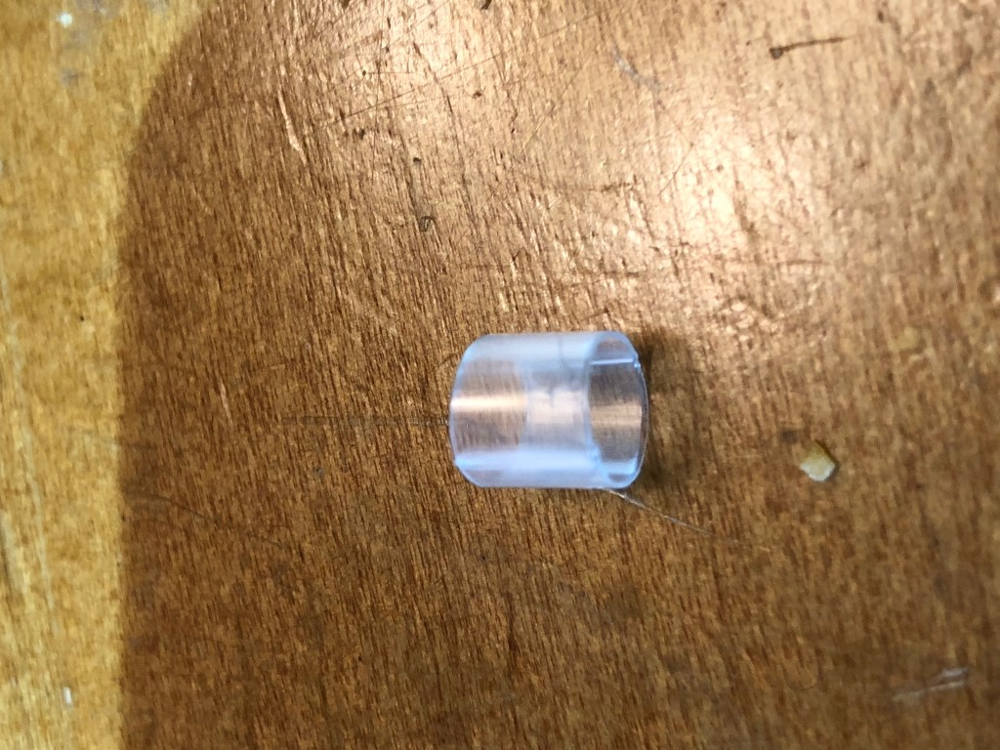
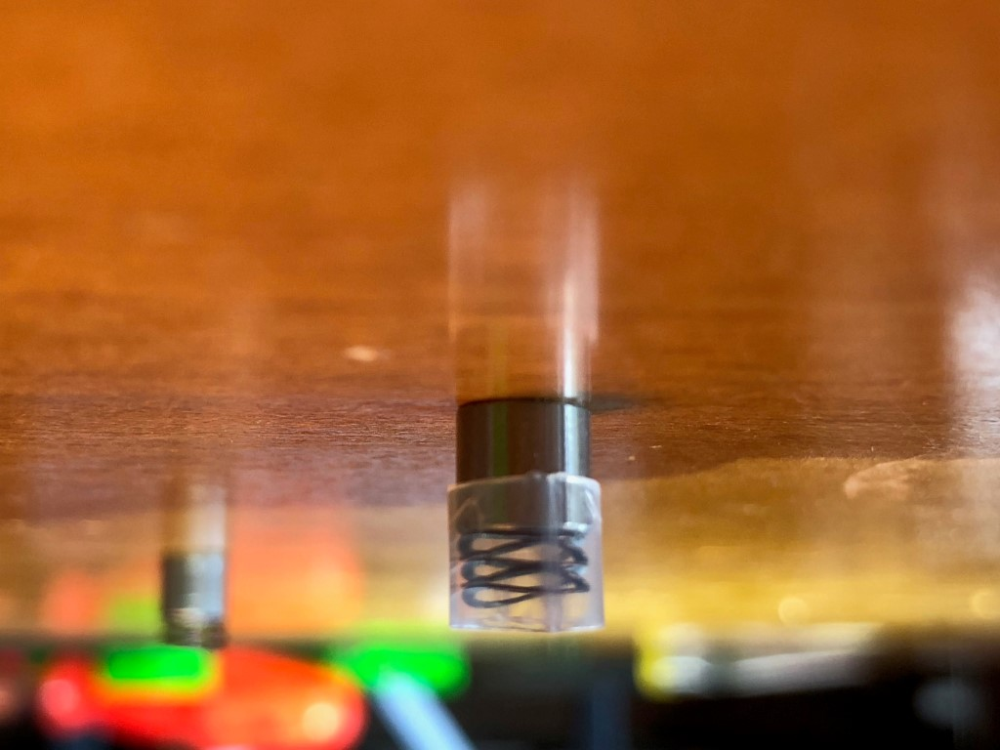
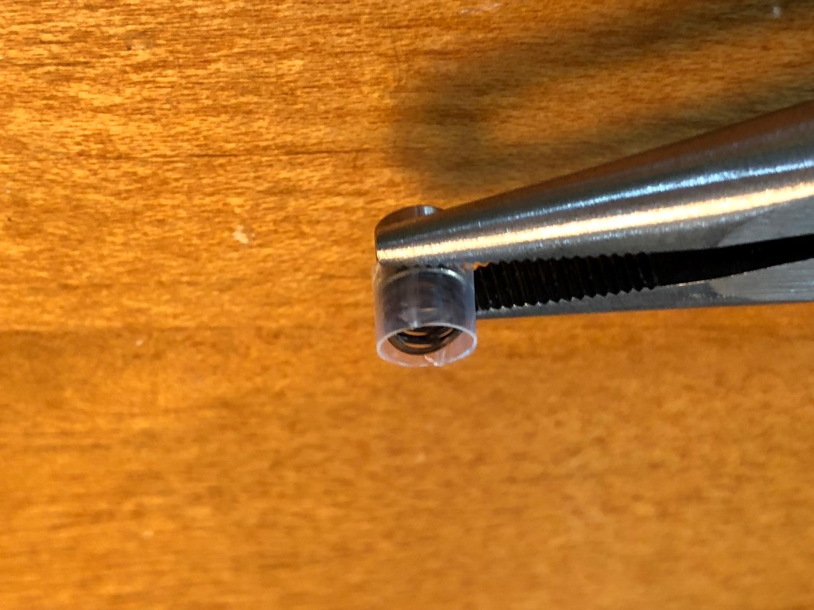
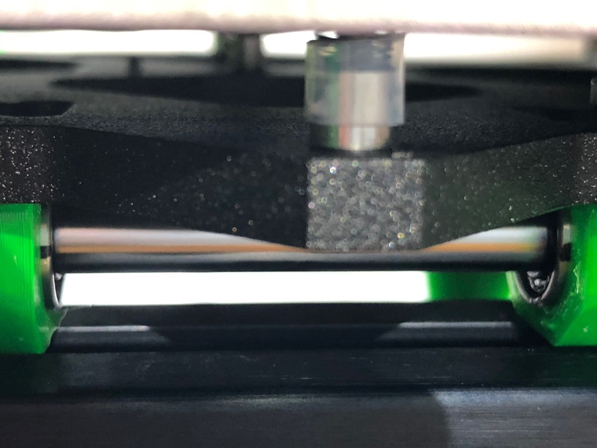
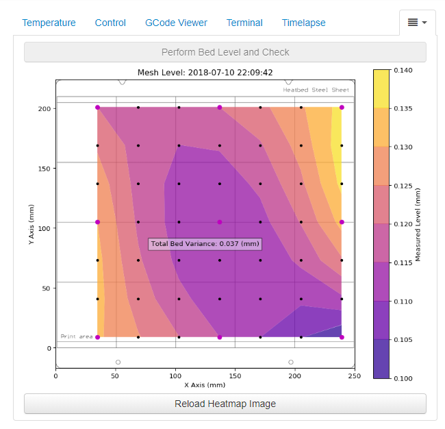

The Prusa firmware has an auto-bed leveling feature. This feature uses a probe that is attached to the extruder assembly to measure the approximate height of the probe above the bed service. Since the probe is a fixed and known distance from the nozzle, this value serves as a proxy for the nozzle height above the bed. The Prusa MK3 firmware probes this height at 9 points across bed in a procedure that you have no-doubt observed before prints and during the printers initial calibration process. The firmware than takes these 9 points and extrapolates them into a 49-point matrix. This matrix is used during print to make micro-adjustments to the nozzle (Z) height to partially compensate for the bed not being perfectly level.

Although this electronic adjustment is a wonderful feature, and does improve first-layer, and hence print, quality, it is not as good as having a mechanically level bed. As it turns out, there is a simple way we can make the bed much closer to a perfect level, and in the process make life for the Prusa firmware much easier, and give overall better results.

To achieve this, we will insert springs between the spacers and the MK52 heatbed, and then use screw tension to compress each spring the appropriate amount to make the bed approximately level. There are two options for the springs needed for this task, so let's start by discussing each, and where to get them.

Before we get started, I should mention that before going through the leveling procedure, it is very important to ensure that your z-tops and Y rod holders are as parallel as possible (TODO: Need link describing how to do this).

Wave Springs
------------

Wave springs are visually similar to washers. They have a bent appearance and under load tend to flatten out. They are similar to a small spring you can adjust. By installing these between the Y carriage and the bed of any 3D printer and using a program such as Prusa Mesh Bed Visualizer (see below for details).

The wave springs many people are using are available from McMaster-Carr, part number [92168A101](https://www.mcmaster.com/#92168a101/)

Multiwave Springs
-----------------

Amazon.com sells a product they call “Multiwave Washers”. They look like small springs, but if you look closely appear more like multiple wave washers stacked on top of each other. They provide a larger range of adjustment than the Wave Springs described above. These springs are available [here](http://a.co/5iHSq7o). In case the product link changes, the product name is “Multiwave Washers, 17-7PH Material,Compression Wave Spring，CM06-M3, Metric, 4mm ID, 6mmOD, 0.15mmThick,Material width0.61mm,5 Turns, Free height2.54mm, 9.09 N/mm Spring Rate, 12N Load Capacity”.

Installing the Springs
----------------------

The process to install the two types of springs is different, so we'll go over each independently. By the way, if you're wondering which spring to choose, most people find the Multiwave springs to be a better option. They are also considerably easier to install if you utilize the “straw technique” discussed below. To install the single wave springs, you first slide the spring over the appropriate hole, and then using the pliers move the spacer into place. Lift up on the spacer so that you clear the spring and don't push it out of the way. Once you've achieved this feat of manual dexterity, quickly insert something like a small hex wrench to hold everything in place while you get one of the bed screws. Carefully remove the hex wrench, and replace it with the screw. Screw it down just slightly - just enough so that you're sure it won't come out, and then move onto the next position. We don't want to tighten the screws too much now, because we need to be able to lift the bed up to clear the spring when we are inserting a spacer.

If you find this is too much for you, one trick you can do is to use a little dielectric grease (sometimes called bulb grease) to help hold the washer in place. Dielectric grease is a good choice because it's not electrically conductive, it's stable under the temperatures generated by the heatbed, and it's very viscous.

### Installing Wave Washers / Springs

The process to install these springs is simple, but it requires a bit of manual dexterity. Basically you To install the wave springs, you place a washer flat against the frame above the

### Installing the Multi-Wave Springs

It can be a bit of a challenge to install these springs. It is almost impossible to hold the spring on the waster, insert it under the screw hole in the heatbed, and then insert a screw through all three. However, there is a technique you can use that makes it a relatively simple, if tedious, process.

First you should install the spring, spacer, and screw in the center hole. The best method I have found to do this is to insert the screw through the heatbed, add the spring and then the spacer, and then put a small amount of grease on the bottom of the screw to cause all 3 components to stick together. Carefully align the heatbed over the center hole in the frame, using the other holes as milestones. Screw the center screw in slightly. Ok, this was the hardest part.

For the remaining screws, you will need a large straw similar to the kind they have at McDonalds. Cut the straw into 5mm sections. You will need 8 of them. If you can't find a suitable straw in you area, an alternative would be heat shrink tubing (one user heats the heat shrink to really tightly retain the spring and spacer as an assembly).

To install a spring, first place the sleeve (piece of straw) on the spacer. Don't push the sleeve all the way down, however; leave enough sticking up to hold one of the springs. Insert a spring into the sleeve, so that it is resting on top of the spacer and captured by the sleeve.

Now, take a pair of pliers and grip the spacer near the top so you are holding both the sleeve and the spacer.

Finally, place the sleeve, spacer, and spring in place on the frame over one of the holes. Align the heatbed if necessary (you can use the other holes to do a visual alignment check). I like to insert a small hex wrench into the hole to lock in the alignment until I can grab a screw. Insert a screw and tighten it a turn or two. Repeat for the remaining 7 spacers.

If you cut the sleeves to the size mentioned above, they shouldn't interfere with anything. However, if you want to remove them - because you're concerned about plastic underneath the heatbed, or whatever - you can take an exacto knife and cut them apart, and then remove them with pliers. Or... use a straw with a diameter slightly smaller than the spacer. Cut it first, then wrap it around the spacer and spring. After fixing it with the screw, grab the sleeve with the pliers and it should just pop off.

All done! Now follow the steps discussed below to mechanically level your bed.

Leveling Your Bed
-----------------

Now that we have the springs in place, we are ready to perform the actual bed leveling procedure. You could tell the printer to perform the bed leveling procedure by sending it a g-code (G80), and then read the values back out using another g-code (G81), and then use the returned values to figure out which screws to tighten or loosen. But it's considerably easier if you have some software to do this task.

The software we will discuss here is a plug-in for the popular Octoprint software. Several of the Discord users collaborated on a [Octoprint plug-in](https://github.com/ff8jake/OctoPrint-PrusaMeshMap) that shows a representation of the mesh bed leveling points, and the interpolated contour that the Prusa firmware uses. This plugin requires stock Prusa firmware as of right now, with Klipper support hopefully coming soon. Indications are that the Klipper support will be even better because it will measure more than 9 points!

Some sample output from this plug-in can be seen in the screenshot below.

You use this plug-in to run the mesh bed leveling routine, view the generated contour map, make leveling adjustments by turning one or two of the bed screws, and then iterate on this process until you have something you are satisfied with.

To determine which screws to turn, and how much to turn them, first start by putting all the screws at a position where the screens are approximately 50% compressed. It's not critical to be exact here; we are just trying to ensure we have some margin to adjust each screw in each direction (tighter or looser). Use the plug-in to perform a bed level check. Wait for this to complete, and then wait a few more seconds for the plug-in to generate the updated image (it's pretty slow), then press the “Reload Heatmap Image” button. You should see a graph similar to the one shown above.

Note the “Total Bed Variance” value in the center of the graph. This tells you how far you are off level. The pink dots in the graph represent the actual measured values; the black dots are the Prusa interpolated values. Using the pink dots as your milestones, note the color around them. You are looking to find the one or two screws that are most extreme (too low, or too high). You will adjust those screws, and which screws they are may change with each iteration. Remember that the thread pitch on these screws is 0.5mm per turn. So you may have to turn them a half turn or so at first, but after that you will quickly reduce the amount you are turning the screws.

Repeat the mesh map calculation and adjustments until you are happy with the results. I recommend not trying to get better than about 0.03mm. The Pinda sensor is not much more accurate than that, and in addition the bed will vary as you heat it to different temperatures due to thermal expansion.

### Mesh Leveling G-Code

The Octoprint plug-in comes with some default g-code to perform the bed measurements. However, if you want a more accurate measurement, you should modify it to do the following:

1.  Measure the bed when the PINDA probe is at some consistent temperature (35C is the lowest value I would recommend).
2.  Make the measurements with the bed at some consistent temperature, ideally something close to the temperature you most frequently print at.

**For those running Prusa firmware 3.3.0 or higher**, you can use the script below. This script first waits for the PINDA to cool down to 35C or lower, than heats the bed up and waits for it and the PINDA probe to reach a desired temperature, then runs the mesh bed measurement and outputs the results.

`G28 W ; home all without mesh bed level`
`G0 X50 Y50 Z70 F1500 ; Raise PINDA in case cooling is needed`
`M860 S35 ; Wait for PINDA <= 35C`
`M190 S60; set and wait for bed temp`
`M104 S170  ; set nozzle temp`
`G0 X50 Y50 Z0.15 F1500 ; this is a good PINDA heating position`
`M860 S35 ; wait until PINDA is >= 35C`
`G80 ; mesh bed leveling`
`G81 ; check mesh leveling results`
`G4 ; wait`
`M104 S0 ; turn off temperature`
`M140 S0 ; turn off heatbed`
`G0 X50 Y50 Z70 F1500 ; Raise PINDA back for next iteration`

**For those running Prusa firmware earlier than 3.3.0**, you can use the script below. This script is identical to the one above, except that it does not first wait for the PINDA probe to cool down (because the firmware does not support this feature).

`G28 W ; home all without mesh bed level`
`G0 X50 Y50 Z70 F1500 ; Raise PINDA in case cooling is needed`
`M190 S60; set and wait for bed temp`
`M104 S170  ; set nozzle temp`
`G0 X50 Y50 Z0.15 F1500 ; this is a good PINDA heating position`
`M860 S35 ; wait until PINDA is >= 35C`
`G80 ; mesh bed leveling`
`G81 ; check mesh leveling results`
`G4 ; wait`
`M104 S0 ; turn off temperature`
`M140 S0 ; turn off heatbed`
`G0 X50 Y50 Z70 F1500 ; Raise PINDA back for next iteration`