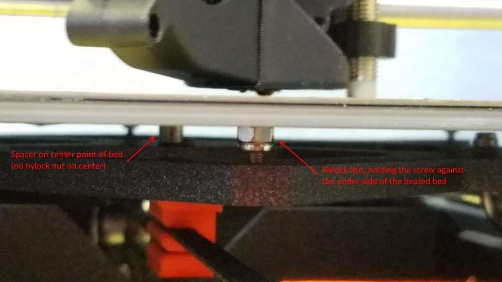

Having levelled my bed with wave springs (using the more common single wave springs) I got great results initially, but over time I had to keep adjusting due to thermal variation and so on, but to compensate for this I had to keep adjusting the screws downwards as the wave springs gradually lost their spring. After a couple of months I ended up with flat washers instead of wave springs, and thus decided to try this approach.

The idea is to take out the reliance on a compressed spring, which will gradually lose it's un-sprung shape and tension, and instead make it a threaded adjustment. Basically instead of relying on a spring to push the bed up to the top of each screw, make it so the bed and screw are held together more tightly in the first place, and just use the thread to adjust the height more directly

The other benefit of this approach, is having a single fixed reference point. One of the downsides of using spring washers on all 9 bed points is never knowing which point to adjust.

By making the center point an absolute fixed reference, and adjusting other points around it, it actually makes the leveling process far easier and more intuitive.

Unfortunately the standard Mesh bed levelling output is not relative to any single fixed point, adding to the usual confusion about what's actually changing. i.e. if you change one point on the bed the numbers for all points change, regardless of whether they actually move or not. By making a simple firmware change to make the mesh-levelling output have all points relative to the center (without actually affecting the levelling algorithm) bed levelling is far more intuitive. (This could also be accomplished by changing the plugin, which I will investigate, but I like to be able to use the numbers without the plugin, for more absolute values ... you can use the actual mm offset to determine how far to turn each screw, remembering that one full turn is 0.5mm)

So ...

Installation/Setup Procedure
----------------------------

Before starting you will need 8x M3 Nylock nuts (aka nylon lock nuts)

1.  Move the Z axis to the top, to ensure it doesn't cause an obstruction
2.  Ensure the heated bed and nozzle have cooled down
3.  Turn off power to the printer
4.  Remove the steel sheet from the heated bed
5.  Remove all 9 screws from the heated bed, and set safely aside
6.  Carefully lift the heated bed off the Y carriage, and rotate out of the way (optionally you may wish to disconnect the heated bed cables. It's probably safer to do this at the einsy end. Be particularly careful of the sensor cable)
7.  Remove and store the metal spacers/standoffs
8.  Put one of the M3 countersunk screws back into one of the holes in the perimeter of the heated bed
9.  Optional: put a nylon M3 washer on the screw thread, on the underside of the bed. (I have not done this, so am not sure how this will affect levelling consistency, but it might make adjustment easier in theory)
10. Put one of the Nylock nuts onto the thread of the nut, on the underside of the bed, making sure of the orientation of the nut (the end with the white nylon visible goes away from the bed, most visible)
11. Tighten the Nylock nut and screw, using an allen-key/hex-wrench and a 5.5mm wrench or socket
12. Tighten until the nylock nut just starts to bite down against the bed, so the screw does not turn freely without the nut being held, then back the nut off a tiny amount (1/16th turn or less) so that the screw can be turned, but is not loose
13. Repeat steps 8-11 for each of the 8 perimeter holes
14. Place one of the spacers removed earlier over the center hole in the Y carriage
15. Place the remaining M3 screw through the center hole in the bed
16. Place the heatbed over the Y carriage, so that the center screw goes into the spacer, and is over the center hole.
17. Orientate the heatbed so that the screws (held in place by the lock nuts) are each aligned over their respective holes in the Y carriage
18. Starting with the front-center screw tighten it by one full turn (NOT more than one full turn)
19. Repeat for each of the perimeter screws in turn, I suggest following a clockwise pattern, turning each screw one full turn at a time.
20. Repeat the full circle 6-8 times, tightening each screw no more than one full turn at a time, and ensuring that each screw is tightened evenly on each rotation.
21. Check to see when the bed is sitting loosely on the center spacer (look underneath the bed, using a flashlight/torch if needed). Repeat tightening of each of the perimeter screws until the bed is sitting lightly on the center spacer.
22. Tighten the center screw. If the screw requires more than one full turn from when the screw starts to bite, for it to become tight, then you may need to further tighten the perimeter screws slightly
23. Check that a spacer can be fitted snugly between the bed and the Y-carriage near each of the perimeter screws. Adjust each screw as needed in order to be able to fit a spacer. Do not leave the spacer in place, just use it as a height gauge and then remove.
24. The bed should now be roughly level (probably VERY roughly, don't expect good numbers yet)
25. Reconnect the heatbed cables if they were disconnected previously.
26. Install the steel sheet on the heatbed
27. Turn on the printer, and run the first mesh bed levelling with the heatbed cold.

Hopefully this photo, showing the front-center screw, with the center spacer visible behind it, might help make this a little clearer: -



Leveling Procedure
------------------

After initial installation I would suggest first leveling with the bed at ambient temperature, since you should be able to get it fairly flat at ambient, and then only see minor variation when heated. You can then make fine adjustments at your usual bed temperature to get the best level possible.

I also strongly suggest using the firmware tweak below, in order to make the mesh-leveling command (G81) output have all points relative to the fixed center. This makes levelling much more intuitive. It's often easier to get a close level using the actual numbers, rather than the mesh-leveling plugin, since you can work out from the numbers roughly how far each screw needs to be rotated (there will be some variation partly due to slop between the screw thread and the thread in the Y carriage threads)

### Steps using terminal/numbers

1.  Type G80 into the terminal (whether using Octoprint, or a serial terminal with the einsy connected to PC)
2.  Wait for the mesh leveling to complete
3.  Type G81 into the serial terminal

You should see output something like: -

|              |          |          |              |          |          |              |
|--------------|----------|----------|--------------|----------|----------|--------------|
| **-0.48750** | -0.42093 | -0.36621 | **-0.32334** | -0.29232 | -0.27315 | **-0.26584** |
| -0.21917     | -0.18561 | -0.16191 | -0.14806     | -0.14407 | -0.14993 | -0.16565     |
| -0.04861     | -0.03746 | -0.03468 | -0.04028     | -0.05425 | -0.07660 | -0.10732     |
| *' 0.02416*' | 0.02352  | 0.01546  | **0**        | -0.02287 | -0.05315 | **-0.09084** |
| -0.00084     | -0.00268 | -0.01147 | -0.02723     | -0.04993 | -0.07959 | -0.11621     |
| -0.12361     | -0.11604 | -0.11549 | -0.12195     | -0.13543 | -0.15592 | -0.18343     |
| **-0.34417** | -0.31658 | -0.29658 | **-0.28417** | -0.27936 | -0.28213 | **-0.29250** |

Note this is using the firmware tweak below, making all numbers center-relative. If not using the firmware tweak, subtract the number of the center point from the others. You only care about the perimeter points that I've highlighted above

You can see from the numbers above that most of the points are lower than the center and, for example, the rear left point needs to be raised almost 0.5mm, or one full turn of the screw anti-clockwise. The rear right screw needs to be adjusted by a fraction over a half turn.

(remember that if not using the firmware tweak below, you'll need to subtract the value of the center point, in order to get the relative values) Ignore all the fictional numbers, especially since the algorithm used to derive them seems utterly broken (I think they're trying to do a curve fit, but with a poor choice of params, though I haven't actually spent the time to look at the algorithm in the firmware).

Adjust all 8 perimeter screws by roughly the amount indicated in the first pass. In subsequent passes focus on the 2 or 3 worst points each time, just to make it easier to make fine adjustments, and see the affect on the other 7 points (there will be some minor effect on adjacent or opposite points, just because the screws are not tight. (I have considered using a regular nut to lock the thread against the Y carriage, but this would be a lot more work, and seemed unecessary based on my testing thus far)

Repeat the calibration steps above, making finer and finer adjustments each time.

Once you're within say 0.05mm, you may wish to switch to doing the calibration with the bed at your normal printing temperature (e.g.: 60deg C)

Repeat until the level is within 0.05mm. You can probably get the level to around 0.02mm variation fairly easily, and with a little patience even closer (but don't get too obsessed,as you'll see little real benefit from your effort if trying to strive for perfection)

Hopefully you might be able to end up with numbers more like these (not actually the best number I got)

|              |          |          |              |          |          |             |
|--------------|----------|----------|--------------|----------|----------|-------------|
| **-0.00667** | -0.00731 | -0.00704 | **-0.00583** | -0.00370 | -0.00065 | **0.00333** |
| -0.00565     | -0.00560 | -0.00461 | -0.00269     | 0.00017  | 0.00397  | 0.00570     |
| -0.00454     | -0.00430 | -0.00303 | -0.00074     | 0.00258  | 0.00593  | 0.00631     |
| **-0.00333** | -0.00343 | -0.00231 | **0**        | 0.00352  | 0.00624  | **0.00817** |
| -0.00204     | -0.00297 | -0.00245 | -0.00046     | 0.00298  | 0.00789  | 0.00826     |
| -0.00065     | -0.00294 | -0.00344 | -0.00213     | 0.00098  | 0.00588  | 0.00659     |
| *' 0.00083*' | -0.00333 | -0.00528 | **-0.00500** | -0.00250 | 0.00222  | **0.00617** |

### Using Octoprint Plugin

TBC

Firmware Tweak
--------------

In order to make the output be center-relative, without changing the actual compensation algorithm, I simply made the terminal output center-relative, without touching anything else

in marlin_main.cpp search for “G81”

and make the following additions (highlighted in bold)

```
       /**
        * G81: Print mesh bed leveling status and bed profile if activated
        */
       case 81:
           if (mbl.active) {
               SERIAL_PROTOCOLPGM("Num X,Y: ");
               SERIAL_PROTOCOL(MESH_NUM_X_POINTS);
               SERIAL_PROTOCOLPGM(",");
               SERIAL_PROTOCOL(MESH_NUM_Y_POINTS);
               SERIAL_PROTOCOLPGM("\nZ search height: ");
               SERIAL_PROTOCOL(MESH_HOME_Z_SEARCH);
               SERIAL_PROTOCOLLNPGM("\nMeasured points:");
               
               float midPoint = mbl.z_values[((MESH_NUM_Y_POINTS+1)/2)-1][((MESH_NUM_Y_POINTS+1)/2)-1];
               for (int y = MESH_NUM_Y_POINTS-1; y >= 0; y--) {
                   for (int x = 0; x < MESH_NUM_X_POINTS; x++) {
                       SERIAL_PROTOCOLPGM("  ");
                       SERIAL_PROTOCOL_F(mbl.z_values[y][x] - midPoint, 5);
                   }
                   SERIAL_PROTOCOLPGM("\n");
               }
           }
           else
               SERIAL_PROTOCOLLNPGM("Mesh bed leveling not active.");
           break;
```

Compile the firmware changes, and flash to the Mk3. You should now always see the center point in the G81 output be 0.0