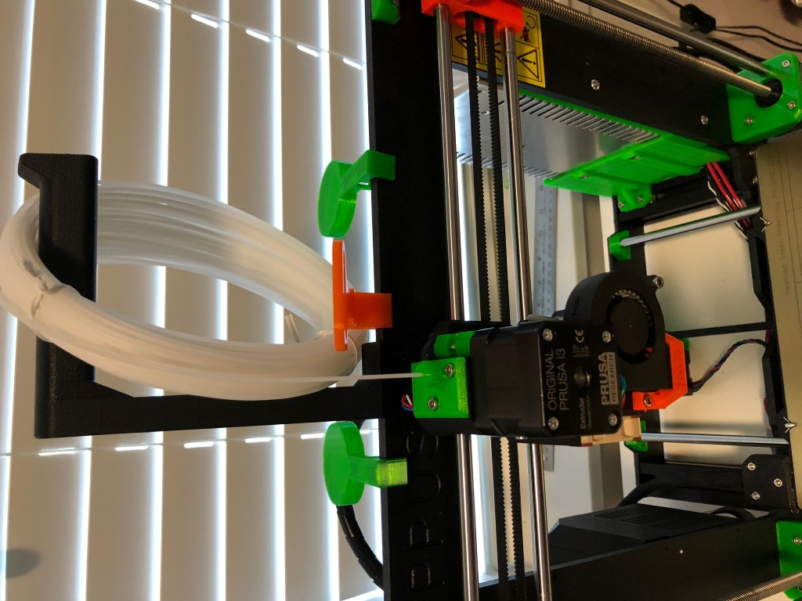
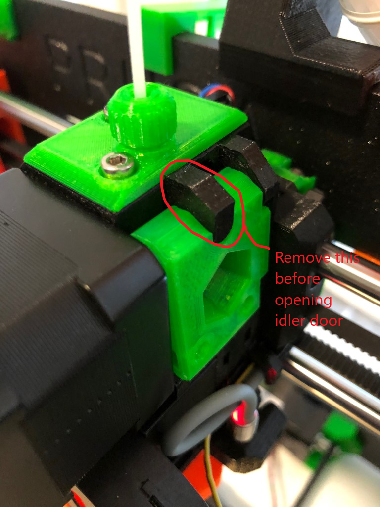
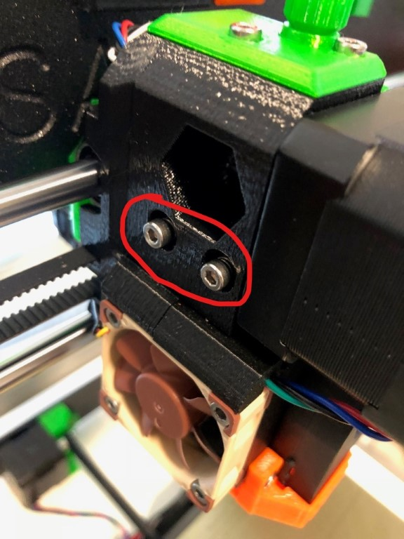
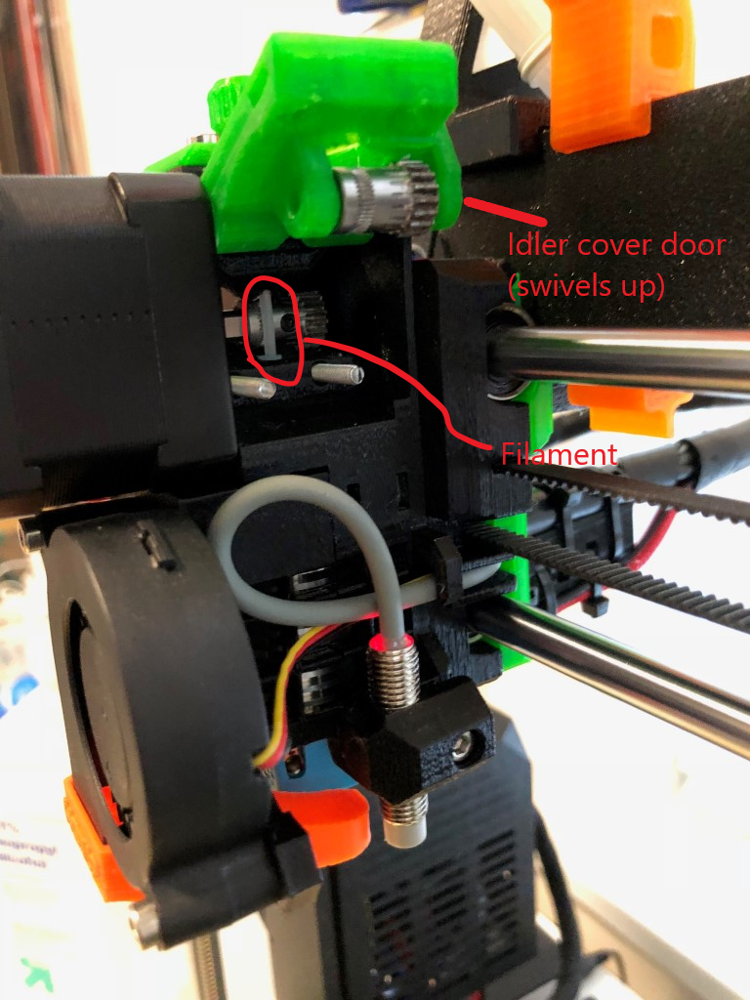

For best results, do your cold pull with some cleaning filament. eSun makes some that works well. These instructions assume you are using cleaning filament.

Using the Settings/Temperature menu, bring the Nozzle temperature up to the temperature you would extrude whatever filament you *were* using.

Load the cleaning filament in the extruder. I like to answer “No” (once) when prompted if it is extruding the correct color, so that I flush a good amount of the cleaning filament through.

Go back in the Settings/Temperature menu, and set the temperature to zero (alternatively - Preheat / Cooldown).

Go find something to do while the nozzle cools down. I usually let it go until the fan turns off (around 40C).

I like to open the idler door. Although optional, you're less likely to damage something if you do this, and if the filament jams on the way out, you'll have to do it anyway.

To open the idler door, first remove the little plug that blocks external light from getting into the filament sensor:

Next, you'll need to loosen the spring-loaded screws that hold the idler door closed:

Now swivel the idler cover door up. You should be able to see the filament inside.

Using the Settings/Temperature menu, set the nozzle temperature to 100C. Return to the top-level menu so you can monitor the temperature.

As the temperature passes 60C, the cleaning filament will start to soften. Grasp the filament near where it exits the extruder, and pull it with firm pressure. Don't use gorilla force - just enough to pull the filament out as it starts to melt. For me this usually happens around 80C. Due to a flaw in the Prusa designed E3D heat break, there is a good chance that the filament will get stuck. If it does, take some wire cutters and carefully cut the filament above the blob, so that you can pull it out the top. Then use pliers to pull out the piece that is still in the extruder. Examine the cleaning filament you just pulled out. Very often you will see a bit of colored filament embedded in this. This is residue from filament you were using.

If you choose (I don't), repeat the process (step 1 - 7) to make sure the nozzle is really clean.