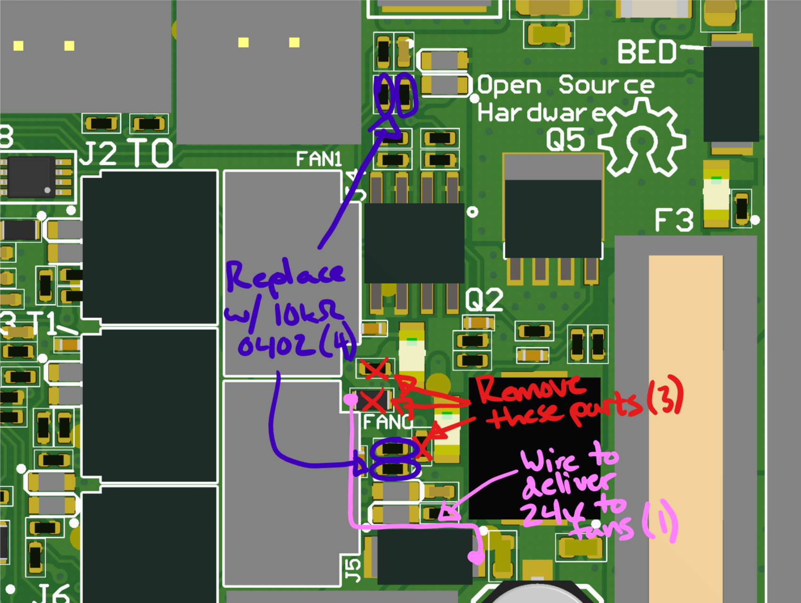

Performant 5 volt fans with tachometer outputs are hard to find. 12 volt fans are commonplace and 24 volt fans are plentiful-enough. So here's a mod to allow an Einsy to natively drive other-voltage fans.

1.  Remove FB23 to disconnect the 5 volt supply to the fans. Red in diagram.
2.  Remove R9, R16 to avoid reverse biasing the LEDs and blowing them up. Red in diagram.
3.  Jump from pad of FB23 footprint closer to the fan connectors to your supply-of-choice, e.g., input supply to the board. Pink in the diagram connects to the input supply of the Einsy, 24 volts on the MK3.
4.  Replace R28, R29, R30, R33 with 10k resistors to reduce dissipation in the protection diodes and series resistor. Pink in the diagram.

Here's a picture to help you along: 