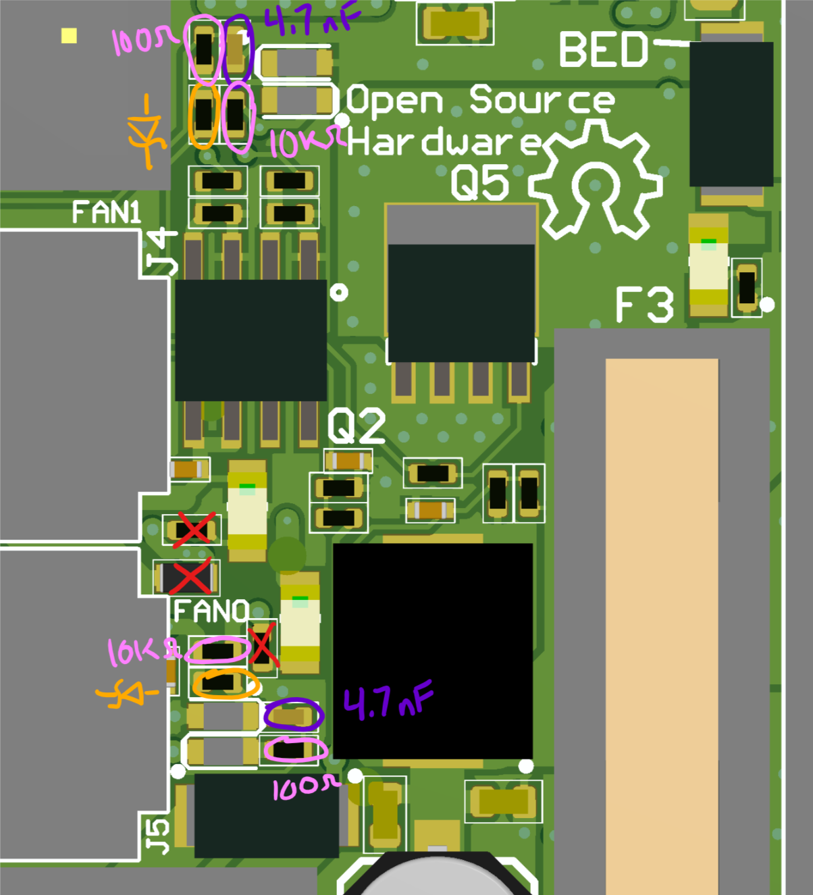
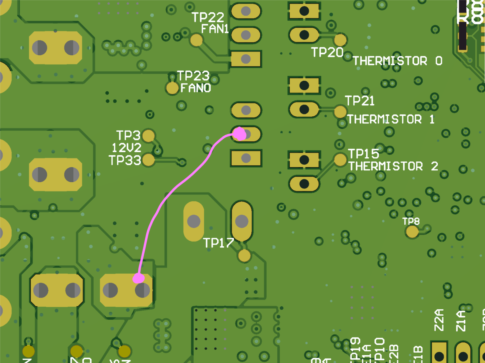

High-performance 5 volt fans with tachometer outputs are hard to find. 12 volt fans are commonplace and 24 volt fans are plentiful-enough. So here's a mod to allow an Einsy to natively drive other-voltage fans.

### Top side board modifications
1. Remove FB23 to disconnect the 5 volt supply to the fans. Red in diagram.
2. Remove R9, R16 to avoid reverse biasing the LEDs and blowing them up. Red in diagram.
3. Replace R30 and R33 with a [Schottky diode](https://www.digikey.com/product-detail/en/comchip-technology/CDBQR70/641-1281-1-ND/1973560) to protect the ATMEGA2560 from poorly-behaved fans. Orange in the diagram.
4. Replace R28 and R29 with [10k resistors](https://www.digikey.com/product-detail/en/samsung-electro-mechanics/RC1005F103CS/1276-3431-1-ND/3903534) to allow a logic pull-up for open-drain fans, but without burning up the resistor. Pink in the diagram.
5. Replace R44 and R55 with (100 ohm resistors)[https://www.digikey.com/product-detail/en/yageo/RC0402FR-07100RL/311-100LRCT-ND/729474] to allow for faster discharge of the filter capacitor. This allows you to read high-RPM fans' tachometer outputs. Also pink in the diagram (oops, sorry).
6. Replace C42 and C43 with [4.7 nF capacitors](https://www.digikey.com/product-detail/en/samsung-electro-mechanics/CL05B472KB5VPNC/1276-6576-1-ND/5961435), also for high-RPM fan tachometer compatibility. It's unclear why so much filtering was put in the design in the first place. Purple in the diagram.

### Bottom side board modifications
1. Connect the center pin of one of the fan headers to the voltage with which you would like to drive the fans. In the diagram, that's the board input voltage (24 volts on MK3). Use insulated wire. I like [solderable magnet wire](https://www.amazon.com/Remington-Industries-24SNSP-125-Enameled-Diameter/dp/B076C9Q19T/) so I that I can strip it in-place with my soldering iron.

