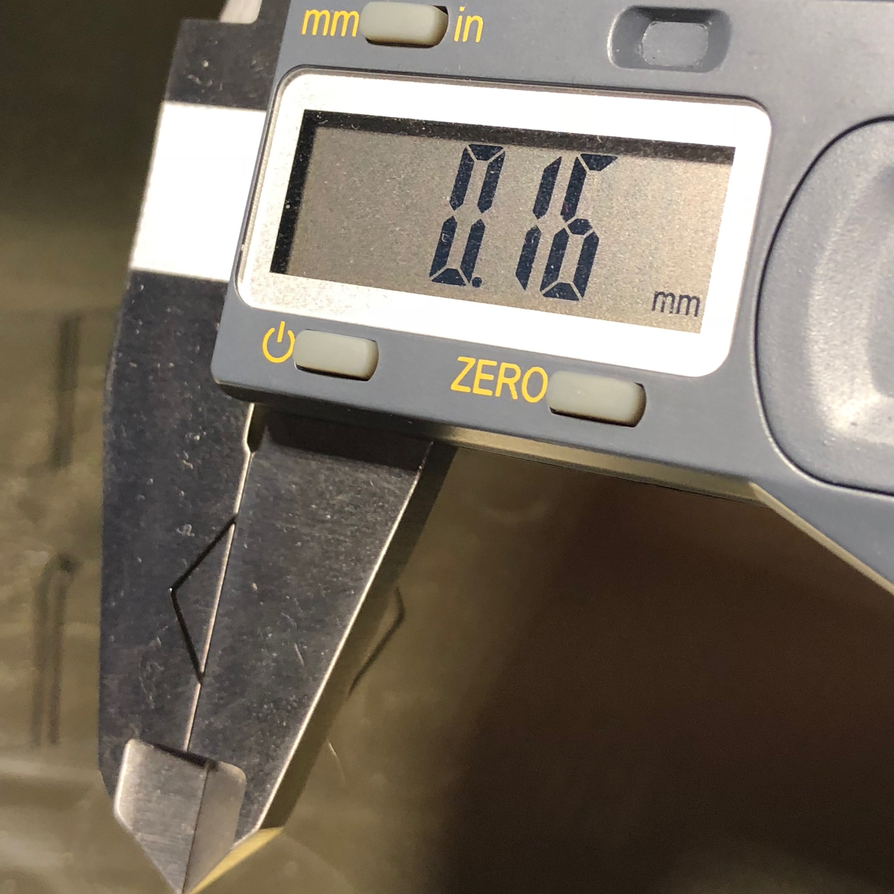

In this guide we present an improved way to adjust both the frst layer height and the PINDA temperature calibration table. This method is based on the original work by _@stahlfabrik_ ([Manual_print_based_PINDA_temperature_calibration](Manual_print_based_PINDA_temperature_calibration.md)) and has the added benefit of improved precision and repeatability. Unlike the [PINDA_Temperature_Calibration_with_Electrical_Continuity](PINDA_Temperature_Calibration_with_Electrical_Continuity.md) method by _@motocoder_, no hardware of software modifications are required.

# Prerequisites

- A Prusa i3 MK3 with the original firmware version 3.3.1 or later, calibrated and capable of producing at least a remotely passable first layer;
- A digital caliper or a micrometer; and
- A specially crafted [test print ](files/First_layer_calibration_6_temp.gcode "wikilink").

You need a tool capable of measuring thickness repeatably with at least +/-0.01mm precision to have 10% error or better. A typical entry-level digital caliper should be capable of that. If you wish (and have the tool) you can use a digital or a vernier scale micrometer.

# Method

## Finding good PINDA temperature compensation values

Start with enabling _Temp. cal._ in the _Settings_ menu on the printer. Then make sure that the compensation table is zeroed out, by issuing `M861 Z` command.

```
Send: M861 Z
Recv: zerorized
Recv: ok
```

Continue with printing `First_layer_calibration_6_temp.gcode`. The print consists of 6 1-perimeter 1-layer high rectangles, each printed after performing the mesh leveling at a different PINDA temperature. As the PINDA has to cool down and reheat to exact set temperature before printing each rectangle, the print may take some time (around 30 minutes). 

This is how the print should look like once it has finished:


After letting the build plate to cool down, proceed to carefully removing rectangles with tweezers or scraper one-by-one.


Measure each rectangle, closing the flat part of the caliper jaws across the two sides of a corner, but leaving the very tip of the corner out, as there may be a bulge. Repeat for each corner and record the high and the low value. Ideally you should be getting identical measurements across all four corners. If the measurements vary dramatically, something is wrong with your mesurement tool, or your bed, and you need to troubleshoot.



Keep in mind which rectangle was printed at which PINDA temperature:

```
,-----, ,-----, ,-----,
| 35º | | 40º | | 45º |
`-----` `-----` `-----`
,-----, ,-----, ,-----,
| 50º | | 55º | | 60º |
`-----` `-----` `-----`
```

Enter the measured layer heights into a table, use the highest value for each rectangle:

35º | 40º | 45º | 50º | 55º | 60º
----|-----|-----|-----|-----|----
0.16| 0.14| 0.15| 0.17| 0.15|0.16

As it can be seen, all layers have different heights. As we want the first layer to always be the same height, regardless of the PINDA temperature, a temperature compensation is needed. It can be derived as follows. The calculations are quite simple and you can do them in your head. Let _H(t)_ be the height of a layer, printed at PINDA temperature _t_. Then the compensation value (in steps) for each layer _C(t)_ is _(H(t) - H(35º)) * 400_.

In other words, each 0.01mm corresponds to 4 steps. If a layer is thinner than the reference layer (35º), the compensation value has to be negative, and positive otherwise.

For the values above, the following compensation table should be used:

40º | 45º | 50º | 55º | 60º
----|-----|-----|-----|----
 -8 |  -4 |   4 |  -4 |  0

Now program the table into your printer, using the following commands:

```
M861 S-8 I0
M861 S-4 I1
M861 S4 I2
M861 S-4 I3
M861 S0 I4
```

You can skip setting 0 compensation values, in this case, `M861 S0 I4` need not be issued. Make sure to use your own offset values after `S` and not my example ones.

Verify your table by issuing `M861 ?`.

```
Send: M861 ?
Recv: PINDA cal status: 1
Recv: index, temp, ustep, um
Recv: n/a, 35, 0, 0.00
Recv: 0, 40, -8, -20.00
Recv: 1, 45, -4, -10.00
Recv: 2, 50, 4, 10.00
Recv: 3, 55, -4, -10.00
Recv: 4, 60, 0, 0.00
Recv: ok
```

Now do the test print again and measure the rectangles. All layers should measure the same or nearly the same.

35º | 40º | 45º | 50º | 55º | 60º
----|-----|-----|-----|-----|----
0.17| 0.17| 0.16| 0.16| 0.16|0.16

Please note that the 35º layer height appeared to have changed while it should not have. This seems to always happen when the PINDA temperature compensation table is changed, for reasons unknown.

The results obtained are already very good, and if a 0.01mm caliper was used, within the measurement error.

If you wish, you can make one more iteration. In this case it would make sense to add -2 steps to 45, 50, 55, and 60º compensation values. Please note that whatever correction values come up with during this and any further iterations, you will have to **add** to the previously set values and not replace them.

## Adjusting the first layer

Now you can adjust your first layer for perfect adhesion. There are two ways to do it:

- The traditional way is to decrease the first layer height using Live Z adjustment until the filament reliably adheres to the printing surface. For me it happens at aroung 0.16mm measured first layer height. The disadvantage is that the height of all printed objects will be lower than it should be.
- The alternative way is to set the first layer height to exactly 0.2mm and increase the first layer flow in the slicer until the filament adheres reliably. The advantages are that this can be configured per-filament and that the object height is unaffected.

Enjoy your perfect first layer!
