Ever since issue 602 was raised there's been considerable investigation into identifying the aspects of the Prusa i3 MK3 that affect the surface quality of the printed parts. A number of potential problems have been found.

The following is a list of modifications that I've made to my MK3 to make the prints look better... without replacing the whole thing. You should consdider it a list of identified issues and their potential solutions. In addition to the items shown here there are further changes that will not be listed in this article as they are more like reworks than fixes. Furthermore, 'very basic' issues like 'having the belts tight enough' or 'ensuring that the PEI surface is clean before printing', will not be covered here.

Note that all the parts I reprinted are PLA with at least 40% infill and 5 perimeters.

This is result of some of the modifications below. Note this is the same gcode file and filament. We need more volunteers to make test-prints for all of the fixes and workarounds.

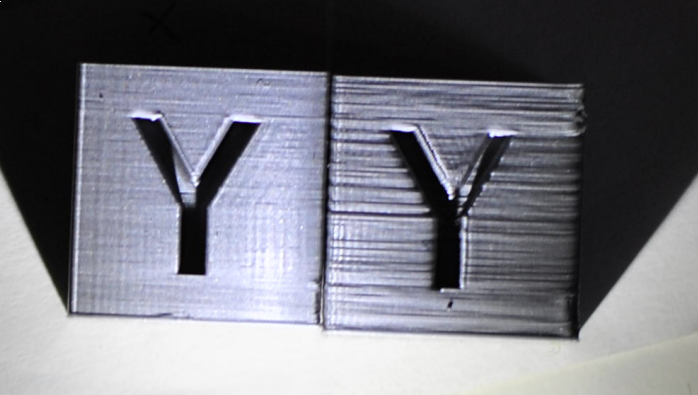

Bearings
--------

This is mandatory on any machine. Your bearings need to have smooth linear motion without any 'crunching'. Loose tolerances that allow you to wiggle the bearings on your rods is highly undesirable. I've replaced the LM8UU bearings on my mk3 twice, the stock ones spat their balls all over my table after 40 hours of printing. The second, Chinese ones, did last a little bit longer, but they've had significant play in them since the beginning.

I suggest that you buy some high quality bearings. Unfortunately these may be pretty expensive and there would be no guarantee that they fit the rods supplied from Prusa Research without loose tolerance or 'play'.

A lower cost alternative is to make your own PLA bearings, which I find superior, but they are a lot of work to get right. I've put the instructions on making them in another article. [PLA bearings](PLA_bearings "wikilink")

Loose rods on Z axis
--------------------

It is important that your Z axis rods are not loose. You should check the Z axis printed parts, top and bottom, to ensure that they sit snugly and cannot be moved My stock z-tops allowed at least 0.5mm of play with the rods, which again, is highly undesirable. I suggest you to reprint the Z-tops if you experience something similar.

You can find improved Z axis printed parts here: [Improved_Z-axis_mounts_by_jltx](Improved_Z-axis_mounts_by_jltx "wikilink"). I've printed the Z-tops, to remove the play, and the Z-bottom (motor holder) because I was disassembling the printer very often and these made that process much easier. They are also more rigid, which is good.

Badly installed Z nuts
----------------------

One common issue with Z nuts is that many people install and tighten them in their X-ends BEFORE they have the whole X and Z axis assembled. I find this wrong because you need to ensure that the rods and trapezoidal screws are parallel. If you tighten the Z-nuts in place and then install the whole X assembly on the Z axis, things will bend, which is not good. To fix this little issue; ensure your Z axis is perpendicular to the X-axis, loosen the screws that are holding both of the Z-nuts, and then tighten them again. This will release any pressure that is being put on the rods or trapezoidal screws.

Extruder assembly problems
--------------------------

### Loose hotend in extruder assembly

Move the X carriage all the way to the left, push on your nozzle, holding the extruder with your other hand. The nozzle should not move at all. I mean it really really should not move, even if you put a quite bit of force on it (just don't break the printer). Repeat it from all the sides, and ensure there is NO wiggle. If there IS wiggle, this will cause a number of problems. On my printer, there was wiggle, and I have also seen how the hotend moves when the printer extrudes / retracts.

I've found a workaround that solves this issue pretty well. Disassemble the extruder assembly (remove the radial fan, unscrew the two screws, unscrew the two screws holding the front part on Noctua). Pull the hotend out of the extruder assembly and find some stretchy tape - I've found that PVC electricians tape works best. Put something like 4 turns of the tape on the e3d's neck. Put some more tape around the bottom of the e3d heatsink, but make sure that it does not touch the heatblock. Then find a knife and cut the tape on the bottom so it only wraps around the last rib of the heatsink. It should look something like this now:

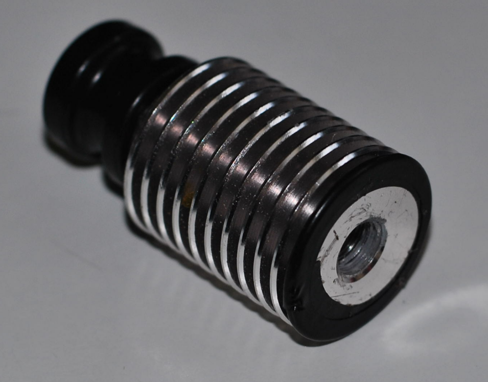

In addition, i'd recommend reprinting the extruder assembly using some less flexible filament than PETG and with additional infill and perimeters.

Since you have the extruder disassembled now, it is a good idea to look at the next section before reassembling.

### Loose PTFE tube in the hotend

The e3dv6 comes pre-assembled, but it's missing one important thing; the locking washer that locks the PTFE tube fitting so the tube can't be pulled out. To solve this I preheated the hotend and made sure that the PTFE tube is inserted all the way down. You need to hold the hotend by the PTFE tube that is sticking out and then pull the black lock thing up, so it locks the PTFE tube in place without any play. It is also good idea to put the locking washer in there, but if you do not have a way of printing them or you do not want to wait until they arrive, you could just use some copper wire, or something similar and tie it below the black lock thing (so that you are unable to press it down anymore).

Reassemble the extruder again and tighten the screws. Make sure that everything is snug this time and your extruder does not suffer from the hotend wiggle anymore.

Extruder gears
--------------

### Drive gears not meshing properly

In order for gears to mesh correctly it's important that the distance between their centre of rotation remains consistent and correct. In the MK3 there are a number of aspects that influence this distance such as: idler springs, variation in filament diameter, loose mounting of the idler itself and loose mounting of the idler assembly. As a result of these variation in distance between the bondtech gears will change over time which causes a number of issues since they are rarely able to mesh correctly when setup in this way. This poor gear meshing causes pressure oscillations in the hotend which will result in inconsistent extrusion.

This is the test object that proves they are problematic (upper one):

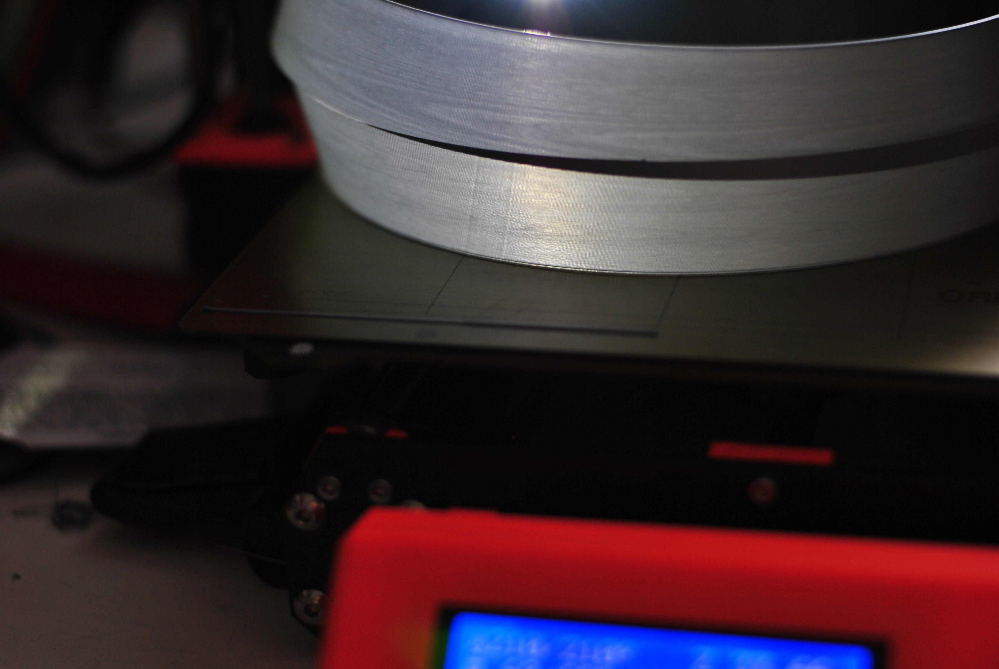

The wood pattern is caused by the drive gears, there is the same number of the '&lt;&lt;&lt;&lt;' as there are teeth on the Bondtech gears. The simplest workaround is to disable them, which could be done by flipping the Bondtech gear on the motor shaft. You will not lose any grip on the filament, there is just no reason to have a powered idler.

### Biting into the filament

This issue affects a lot of printers, but it is usually less pronounced than on the mk3. Since we are on the hunt for surface finish perfection, we need to do something about this. As the extruder gears bite into the filament, the filament going to hotend is not ~1.75mm cylinder anymore. It has those not-so-tiny ripples on it and they cause pressure fluctuations in the hotend. There is not much to do about this. The only slight solution is to loosen the idler screws so the extruder gears just have barely enough grip on the filament causing it to bite less and making the issue less pronounced

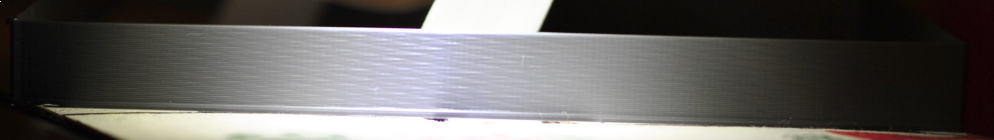

This regular pattern observable on 100mm single wall spiral vase cube is caused by this. There is the same number of the moire lines as there are the tiny 'teeth' on the extruder gear.

What I've done is take my extruder gear to a machine shop and got rid of the hobbed part of the extruder gear.

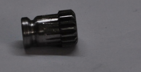

My prints do not suffer from this pattern anymore, and it still provides enough grip to the filament. However, there needs to be some further research to make those gears properly.

You also need to replace the hobbed idler with a bearing, similar to the mk2 style.

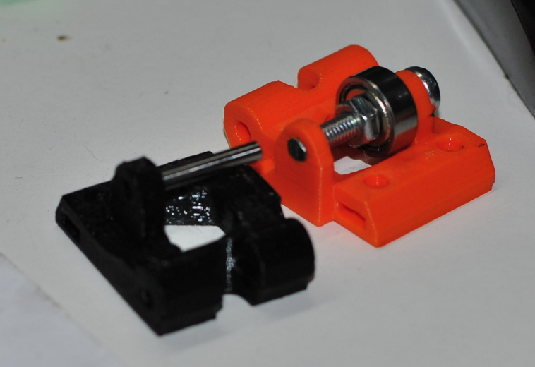

They are published on Thingiverse here: <https://www.thingiverse.com/thing:2965241>

Hotend Cooling Issues
---------------------

Tests on the MK3 with Bowden extruder found that the heatbreak cooling solution is not effective without modifications. This is less apparent with a direct drive setup due to back pressure building much faster in that scenario; however, it **does** still affect direct drive users. The following tests and examples were done on a Bowden system to abuse its larger exaggeration of these effects and prove the theory out. Please keep that in mind as you read forward.

### Testing Methods
<ol>
    <li>After a period of no extrusion (a few seconds) filament in the cool end of the heatbreak gets too hot and becomes soft. This causes sticking and leads to back pressure. Upon starting extrusion manually, this is presented as:
        <ol type="a">
            <li>Initial extrusion is very weak and slow due to stuck filament. Back pressure is building during this phase,</li>
            <li>Extrusion suddenly becomes very heavy. Back pressure has built to a point to overcome the sticking in the heatbreak and the extra pressure is released out the nozzle,</li>
            <li>Flow evens out and remains even as long as extrusion continues. As long as the filament is moving, it remains cool enough above the break that a sticking issue doesn't happen.</li>
        </ol>
    </li>
    <li>3DBenchy is particularly afflicted by this problem in the upper cabin area. To speed testing the cabin area was cropped away into its own STL. Results are as follows:
        <ol type="a">
            <li>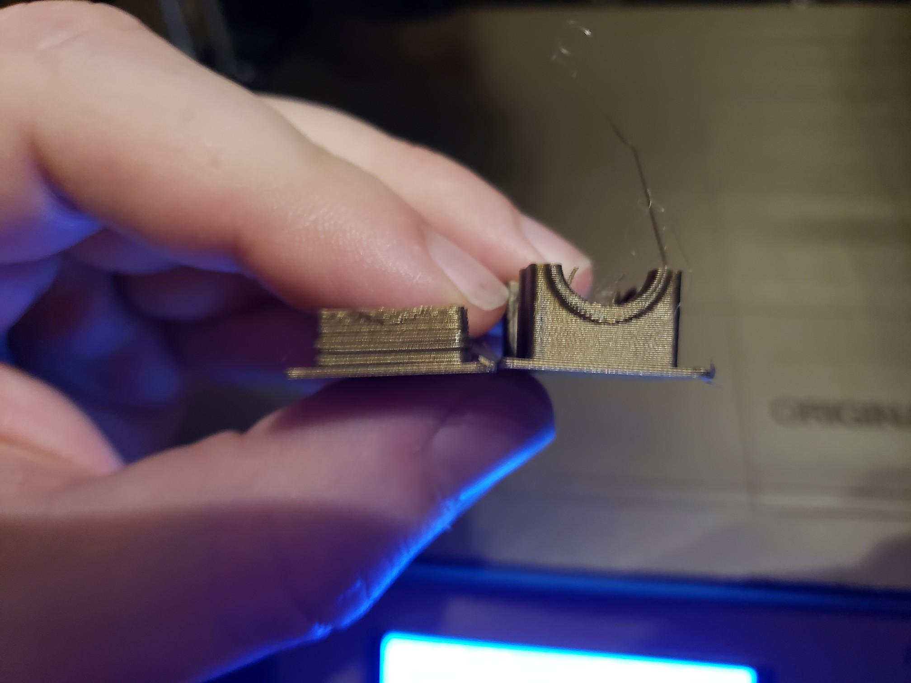In the image, the left hand cabin piece was printed with the stock Noctua fan and R2 extruder parts. It's hard to see the under extrusion; however, you can see the waves of over extrusion that followed after. The right hand cabin piece was printed using a 12v fan powered directly off the 24v input into the Einsy. This is obviously **not recommended**; however, for the purposes of this test it showed that the under/over extrusion cycle was fixed by applying more cooling to the heatsink and thus cooling the heatbreak further.
            

</li>
            <li>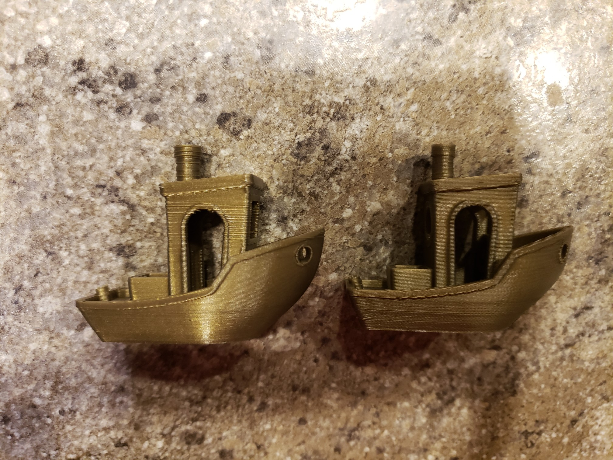In the image, it was found that even with the better cooling, the upper parts of the cabin on the left hand Benchy still had this issue due to Slic3r's “automatic cooling” feature slowing down those layers. Automatic cooling works by decreasing the print speed to allow fresh filament time to cool before another layer goes on top of it. The effect can also be seen in the smokestack. This is ultimately due to the heatbreak not being cool enough on the cold side and filament was lingering long enough to heat up and soften. To prove this out, the right hand Benchy was printed with automatic cooling off and speed at 200% to ensure the filament would have no chance to warm and stick. Artifacts were introduced by running at this speed; however, we can see the artifact in question has completely vanished.</li>
            

</li>
            <li>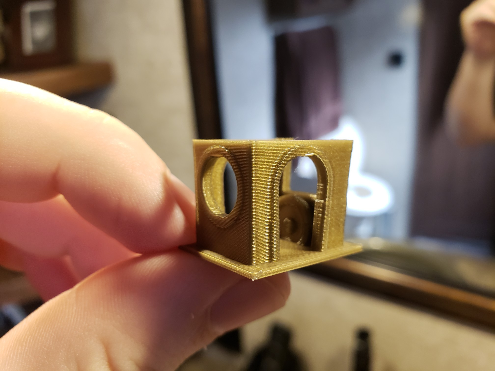In the image, you see a Benchy cabin after installing a 40mm 24v fan directly to the 24v supply (the standoffs on the Einsy 24v input were used so wire routing would be similar). This shows that by increasing the fan output compared to the above tests, we see even more benefit and can drop back down to normal print speeds.</li>
            

        </ol>
    </li>
</ol>

### Cooling Improvements

Several things can be done to improve the heatbreak cooling situation, listed in order of benefit:

1.  Prusa has released R3 extruder parts specifically addressing this problem. They allow more airflow around the heatsink, less back pressure on the very weak Noctua, and a venturi booster vent allowing for increased throughput. **This will greatly augment the other things listed below! Most of these issues are caused by bad R2 design!**
2.  Replace the weak 5v Noctua fan with a 24v 40mm equivalent. Static pressure should be prioritized over CFM when making your fan selection. This can be wired directly to the 24v input standoff on the Einsy board to keep a similar wiring situation to stock. **You will likely fail self test until a method is found to monitor RPM with these higher voltage fans.**
3.  Insulate the hotend heater block with ceramic tape. This offers several benefits, in this case in particular though it will help isolate the heater block from the heatsink above it. The radiant heat from the block transfers into the heatsink above raising its temperature significantly. Preventing this heat transfer will allow the heatsink to wick away heat from the break more efficiently.

### Direct Drive Before and After

Coming soon.

X ends not strong enough
------------------------

You may notice that when you put some pushing force on the extruder carriage, the X-ends start to twist, even the slit that is used to make the bearing insertion easier starts to open. It is a good idea to reprint these too. There are some better designs involving easier belt tensioning and providing some extra rigidity. For example these: https://www.thingiverse.com/thing:2964026

Belts rubbing
-------------

Belts sides rubbing on the motor pulley or the idler are problematic too. You may need to adjust this, or even buy some proper idlers that are designed to prevent this.

Firmware
--------

The stock firmware does suffer from some timing issues TODO: put some reference on logic analyzer results here? This is what Klipper fixes. Until this is fixed in the stock firmware I suggest using Klipper, although it is not exactly user-friendly daily-driver yet, guys are working hard on it.

Linearity correction
--------------------

Linearity correction needs to be done on all axes but particularly the extruder axis as stepper nonlinearity may result in more inconsistent extrusion. Non-linearity on XY plane will cause vertical ripples on the print. See the top left cube, this is something that is clearly not caused by belts nor ringing. This needs to be fixed now, we do not have a proper solution yet. Both klipper and stock firmware do support linearity correction, but stock firmware suffers from other issues, and klipper does not yet support setting linearity correction value during print.

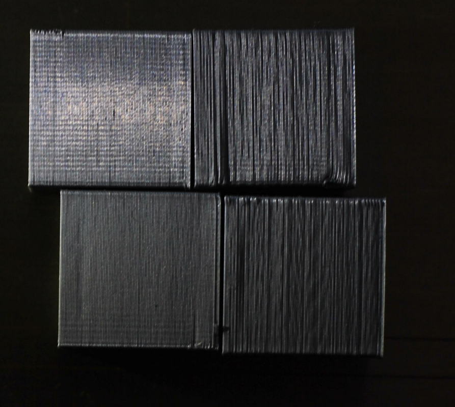

Replacement feet
----------------

The stock rubber feet included with the MK3 tend to make vibration problems worse. Many users have found much improvement by replacing the stock rubber feet with rigid (or significantly more rigid) feet of some type.

The image below was printed half way up using the stock rubber feet, and the other half was printed with rigid feet:

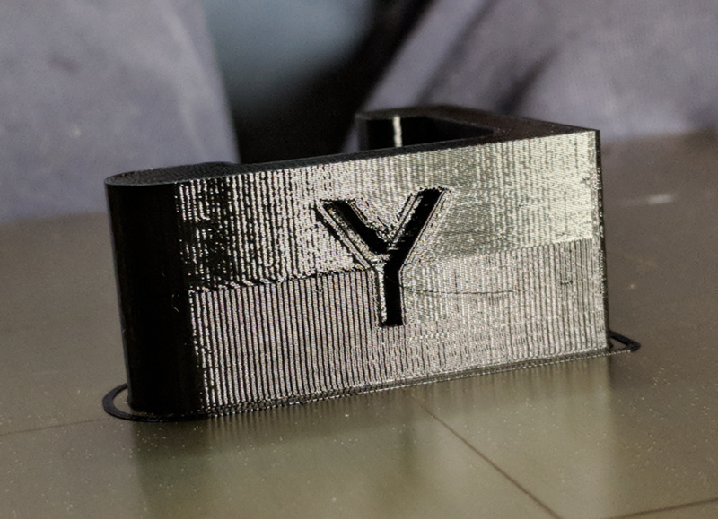

There are already a couple options out there for hard feet:

-   <https://www.thingiverse.com/thing:2805753>
-   <https://www.thingiverse.com/thing:2802540>

Either of these modifications is very easy to implement and will improve surface quality; however, they will make your printer a bit more audible.

### The Rigid vs Absorption Argument

More details need to be added here on why rigid feet outperform vibration absorbing ones. It's a common misconception that vibration absorbing springy feet will help print quality, when they are primarily for acoustics.

The theory on this is that the rubbery feet causes mechanical reverb.

Flipping the Y belt 90°
-----------------------

This needs further research

Nozzle polishing
----------------

This needs more testing

<Category:Klipper>