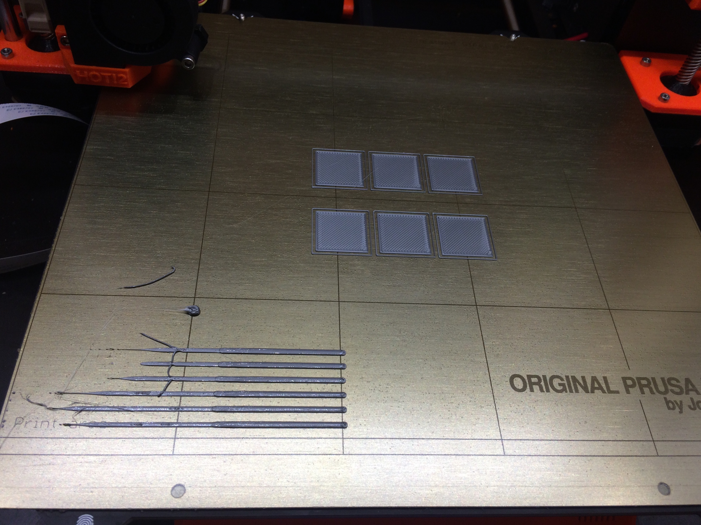

This is valid for MK2.5 and MK3 and newer.

Background information
----------------------

On the Original Prusa i3 MK2/s and MK3 printers, instead of a traditional endstop switch, the Z-axis uses a sensor called a “PINDA” probe. The PINDA probe senses the proximity of the steel print sheet and triggers when it is within some distance of this sheet. Depending on the temperature of the PINDA sensor, the trigger distance might be higher or lower. The MK3 PINDA has a built-in thermistor that allows the controller board to determine the approximate temperature of the probe and roughly compensate for this in software. The MK2/s has no such thermistor, so no compensation is possible there.

To achieve this temperature compensation. the MK3 firmware uses a small table stored in EEPROM. This table stores offsets (in usteps) from a baseline triggering distance measured at 35C. Each entry in the table represents a 5C offset from the previous measurement (so temperatures of 40C, 45C, 50C, 55C and 60C). The offset for 35C is not stored and is the baseline value to which the other offsets apply (we can consider its offset to be “zero”). When the MK3 was first released , it used a fixed pre-populated temperature calibration table. Although the initial launch-date firmware included an automatic temperature offset calibration routine, for many users this yielded results worse than the default table.

Since product launch, there have been many improvements in this area; Prusa has incorporated two GCODEs (both contributed by forum user stahlfabrik) that solve problems with the PINDA measurement and make it possible to fully compensate over the PINDA temperature range, even if this compensation requires a negative offset value. In addition, the table in EEPROM is now populated with zeroes by default (so no compensation is applied). There is a setting in the printer menu that you can toggle to activate or deactivate temperature calibration. This setting is “off” in the factory default configuration. The reason for the changes to the temperature compensation feature is that it is better to have no compensation than bad compensation. With the previous design, some unlucky users found that the compensation worked in the opposite direction, making temperature-induced error worse instead of better.

With the current firmware, a badly calibrated PINDA is an absolutely unnecessary problem that you can get rid of easily. The approach suggested here will allow you to populate the PINDA temperature compensation table so that you get repeatable, accurate results across the expected PINDA temperature range. This calibration procedure takes two to three hours and is easy to perform. Although you can try the build in automatic temperature calibration, for me it has not yielded good results (although in fairness, I have not tried it for some months).

So when do you need to do a temperature calibration? If you find that your perfectly dialed in Live Z value is not correct when doing back-to-back prints or that it sometimes works, but other times does not. If you know or suspect this temperature variation to be the source of your error, then you should go through the calibration process described here.

Step by step - manual print based PINDA temperature calibration
---------------------------------------------------------------

The process takes only an evening and is not hard to do. The following steps have to be performed:

1.  [Prepare GCODE files](#prepare-gcode-files "wikilink")
2.  [Disable temperature calibration](#disable-temperature-calibration "wikilink")
3.  [Find Live Z value for each temperature](#find-live-z-value-for-each-temperature "wikilink")
4.  [Caculate offsets](#calculate-offsets "wikilink")
5.  [Store offsets in EEPROM](#store-offsets-in-eeprom "wikilink")
6.  [Enable temperature calibration](#enable-temperature-calibration "wikilink")
7.  [Set Live Z to the 35C value](#set-live-z-to-the-35c-value "wikilink")
8.  [(Optionally) verify temperature calibration](#optionally-verify-temperature-calibration "wikilink")

### Prepare GCODE files

[1st_layer_35C.stl](files/1st_layer_35C.stl "wikilink") is a very simple STL that consists of a rectangular shape that is 0.2mm high (any rather large 1st layer will do:-)). You import that to your slic3r and use your favorite (PLA) profile to slice. When you have the gcode file on disk (suggested name: “1st_layer_35C_PLA.gcode” or similar), open it in a text editor and modify it so you can use it for the manual temperature calibration process. The change you will be making is to add the M860 g-code. This g-code instructs the printer to wait for the PINDA to reach some temperature or beyond, either cooling (reach temperature or below) or heating (reach temperature or above).

Here is a snippet that I use for the 35C gcode:

```
...
M83  ; extruder relative mode
; cooldown
M104 S0 ; set extruder temp
M140 S0 ; set bed temp
G28 W ; home all without mesh bed level
G0 Z100 ; Cooling PINDA position
M106 S255 ; Turn fan on
M860 S30; Let PINDA cool down to 30C
M107 ; Turn fan off
; warmup
M104 S215 ; set extruder temp
M140 S60 ; set bed temp
M190 S60 ; wait for bed temp
M109 S215 ; wait for extruder temp
G0 X50 Y50 Z0.15 ; this is a good PINDA heating position
M860 S35 ; put here the temperature that you want to calibrate
; start the print
G28 W ; home all without mesh bed level
G80 ; mesh bed leveling
...
```

You can see the “cooldown” section, where I let the PINDA cool down 5C below the start temperature. There is also the “warmup” section where I set the bed and heater and then wait for the PINDA to reach the start temperature. Note that both sections use the M860 command. When the printer receives the M860 command, it checks if both heatbed and nozzle heaters are off. If so, it treats the M860 command as an instruction to wait for the PINDA to cool down, and will wait until the PINDA temperature is at or below the specified value. Otherwise, it treats this command as instruction to wait for the PINDA to warm up, and will wait until the PINDA temperature is at or above the specified value.

Once you have edited the file, make a few copies of it, renaming to ...40C.gcode, ... , ...60C.cgcode. In each file set the cool-down and the warm-up temperature values accordingly. Note that to reach the higher PINDA temperatures you may have to increase bed temps as well.

Here is what I use:

| PINDA target temp | Used bed temp |
|-------------------|---------------|
| 35C               | 60C           |
| 40C               | 60C           |
| 45C               | 60C           |
| 50C               | 80C           |
| 55C               | 90C           |
| 60C               | 100C          |

### Disable temperature calibration

There are two steps you should do to clear the old temperature calibration values from the table and turn PINDA temperature calibration off:

1.  In the printer menu, turn the setting for “Temp. Cal.” to “off”.
2.  Use the terminal to your printer to send the command “M861 Z”. This sets all offsets to zero. You can verify that the values were cleared to zero by sending “M861 ?”. This g-code command will instruct the printer to output the current offsets in the EEPROM table.

### Find Live Z value for each temperature

Now comes the fun part. Load a PLA filament with a color that is conducive to observing the first layer properties during live-Z adjust (makes it easy to see the gaps and the surface texture). Print the first file (the 35C gcode) and dial in Live Z. The goal here is not necessarily to achieve the best/optimal first layer - but that you hit a first layer with properties that you will be able to reproduce with the other five gcode files that you will print later. The procedure that I follow is to raise Live Z a bit, then lower it down, until there are just no more gaps in-between the extruded strands. When I take remove that first layer from the print bed, I check to make sure that I do not see any direct light shining through gaps between the strands. Usually, it is totally achievable to hit that spot in just one try, so this process should proceed rather quickly.

Repeat this process using the g-code files for all the temperatures. For each temperature, note the live Z value that gave the desired results.

### Calculate offsets

I use a spreadsheet to calculate the offset values, but any calculator will do. Prusa has written “my” formula in a quite concise way on their wiki (link below), so I will just reproduce here:

```
usteps(T) = (live_adjust(35) - live_adjust(T)) * 400
```

The ustep values have to be integers, so round them off. Be careful to keep track of the sign; the sign is important! I mostly get negative values, but others often get more positive values.

### Store offsets in EEPROM

To store the values to the EEPROM, we use that first new code again: M861

To store -5 for the 40C value, you send the printer “M861 S-5 I0”. And as another example, to store 11 in the 45C offset value, sou send “M861 S11 I1”. So, “I” denotes the index into the EEPROM table, ranging from 0 for 40C to 4 for 60C - remember the value for 35C is the reference point and thus always zero.

By the way, if you want the old standard EEPROM table, you can set that with “M861 !”. I already mentioned that “Z” zeroes the table and “?” queries and prints the table.

### Enable temperature calibration

Now that our EEPROM table is full of reasonably accurate calibration values, we should re-enable temperature compensation in the printer menu. Got to “settings” and enable “temp. cal.”.

### Set Live Z to the 35C value

As the last step, you should set live Z now to the value that you found out when printing the 35C gcode file. It is also fine to now fine tune that live Z value for perfection - tell me more about it;-)

### (Optionally) verify temperature calibration

If your Prusa i3 MK3 runs at least version 3.3.1 you can use [Temp_cal_veri_v5.gcode](files/Temp_cal_veri_v5.gcode "wikilink") gcode file. The purpose is to have a printable test to verify that the values in your EEPROM value are good. The Gcodes prints six squares in one go, on the same plate. This takes a while because the PINDA has to cool down in between printing of each square. You just have to watch and wait. The top left square is printed with a PINDA temperature of 35C, right next to it is a 40C square printed and so on. So the squares are:

```
35C 40C 45C
50C 55C 60C
```

Here is picture of how that print looks like: 

You can visually inspect the squares to make sure that each first layer looks good.

How to take advantage of the temperature calibration table
----------------------------------------------------------

So now that you have calibrated the temperature compensation table, you need to make sure that your PINDA is always in the temperature range of 35C to 60C before the printer homes and does the mesh bed leveling. A very easy way to do that is to use the code M860 code again. Because the PINDA calibration starts at 35C, we just need to insert an M860 g-code to tell the printer to start a print only when the PINDA is at or above that value. The g-code snippet below shows how to do that, for the Slic3r slicing software (put this in your Start g-code in the printer definition). Note that the M860 occurs **after** the bed and nozzle heaters are turned on. We want this because we want the printer to check the PINDA temp is at **or above** the specified value.

```
G28 W ; home all without mesh bed level
M104 S[first_layer_temperature] ; set extruder temp
M140 S[first_layer_bed_temperature] ; set bed temp
M190 S[first_layer_bed_temperature] ; wait for bed temp
M109 S[first_layer_temperature] ; wait for extruder temp
G0 X50 Y50 Z0.15 ; this is a good PINDA heating position
M860 S35 ; wait until PINDA is >= 35C
G28 W ; home all without mesh bed level
G80 ; mesh bed leveling
```

An Alternative Approach that Does Not Require Temperature Calibration
---------------------------------------------------------------------

If the above process seems too much, and you don't mind waiting a bit longer at the start of every print, then there is an alternate approach you can use that does not require calibration the PINDA temperature compensation table. To do this, we will insert G-code in our Slic3r start-up script that waits for the PINDA to cool down to (or below) 30C, and then start the heaters and wait for PINDA to heat up to 35C. In this way, the mesh bed leveling will always occur when the PINDA is at 35C. As long as we also calibrate our Live-Z value after mesh-leveling at that temperature, the Z-offset values should be consistent.

Here is some example start gcode that achieves this:

```
G28 W ; home all without mesh bed level
M104 S0 ; Turn off all heaters
M140 S0 ; Turn off all heaters
M106 S255 ; turn on fan
G0 Z100 ; PINDA cooling position
M860 S30 ; wait until PINDA is <= 30C
M107 ; turn off fan
M104 S[first_layer_temperature] ; set extruder temp
M140 S[first_layer_bed_temperature] ; set bed temp
M190 S[first_layer_bed_temperature] ; wait for bed temp
M109 S[first_layer_temperature] ; wait for extruder temp
G0 X50 Y50 Z0.15 ; this is a good PINDA heating position
M860 S35 ; wait until PINDA is >= 35C
G28 W ; home all without mesh bed level
G80 ; mesh bed leveling
```

Because the PINDA is always at 35C at the start of the print, there is no need for calibration. Of course, in theory, you could pick any other temperature; you do not “need” to be in the calibration range. But 35C is a good value that has been shown to work.

Questions?
----------

Hit me on the discord @stahlfabrik or read the super long forum thread on the Prusa forum where all that knowledge was worked on: <https://shop.prusa3d.com/forum/-f0/1st-layer-problems-in-depth-look-at-software-pinda-t14815.html> Just bear in mind, that the information on that thread is evolving: you might want to read the first post first, then continue the read from back to front - if that makes sense:-) Prusa also have a very minimal wiki page on that topic: <https://github.com/prusa3d/Prusa-Firmware/wiki/Manual-temperature-calibration>

Alternative Way to Measure Z Offsets
------------------------------------

Discord user @motocoder has come up with an alternate way to measure the per-temperature z-offsets. This alternate approach is faster because it does not require test prints. See [PINDA Temperature Calibration with Electrical Continuity](PINDA_Temperature_Calibration_with_Electrical_Continuity.md "wikilink") for details.
