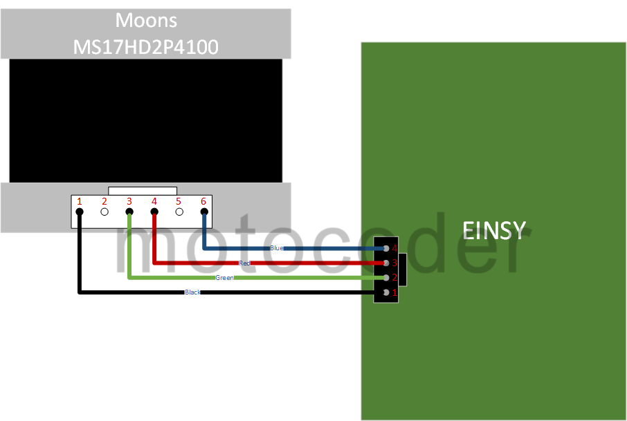
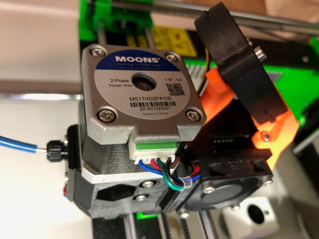

Some people have reported improvements after replacing the LDO stepper motors that ship with the MK3 with steppers from Moons Industries. In general, don't expect a huge print quality improvement from this change, but the Moons motors do run quieter and cooler, and can supply more torque for a given amount of current. Given the issues with extruder heat creep, replacing the extruder motor only would be the best “bang for the buck”.

The Moons motor that is the closest replacement is the [MS17HD2P4100](https://www.moonsindustries.com/p/nema-17-standard-hybrid-stepper-motors/ms17hd2p4100-000004611110008899). This motor will require a custom cable, but otherwise is a drop-in replacement for the LDO stepper on the X and E axis. **On the Y axis, you will have an issue aligning the pulley because the flat on the Moons motor is not machined over the whole shaft** (you can get close by flipping the pulley around).

Finally, note that the Prusa firmware has tuned the motor driver settings for the LDO. Despite this, the settings seem to work OK with the Moons (although perhaps even better performance is possible). One thing to note is that extruder motor linearity correction (e-corr) does not work, so you will just want to disable this feature. Even with it disabled, however, results are similar to the optimized value with the LDO.

Finally, it's worth noting that LDO motors, makers of the stepper motors that Prusa current ships, has sent some samples out to various people of an updated stepper motor with similar characteristics to the Moons. Notably this motor doesn't have the issue with the shaft profile, so stay tuned for a possible better alternative.

Wiring the Motors
-----------------

The diagram below shows a known-good wiring for connecting the Moons to the Einsy. If you follow the wiring in the diagram, using wire with the same color, the order of the wire colors on the connector on the Einsy side will match that of the LDO motors.

Here is a picture showing the wire colors and the connector orientation on the back of a Moons motor.

Parts Needed
------------

| Item                                     | Manufacturer                                      | Part Number                                         | Source                                                                                                                                                                                                                                                                   |
|------------------------------------------|---------------------------------------------------|-----------------------------------------------------|--------------------------------------------------------------------------------------------------------------------------------------------------------------------------------------------------------------------------------------------------------------------------|
| Connector housing on motor side of cable | JST                                               | PHR-6                                               | [Digikey 455-1162-ND](https://www.digikey.com/products/en?keywords=JST%20PHR-6)                                                                                                                                                                                          |
| Connector pins on motor side of cable    | JST                                               | SPH-002T-P0.5S (Select variant per your wire gauge) | [DigiKey 455-1127-1-ND (24-30 gauge)](https://www.digikey.com/product-detail/en/jst-sales-america-inc/SPH-002T-P0.5S/455-1127-1-ND/527358)                                                                                                                               |
| Connector housing on Einsy side of cable | Molex                                             | 50-57-9404                                          | [Mouser 538-50-57-9404](https://www.mouser.com/ProductDetail/538-50-57-9404) [Ultimachine “2.54mm 1x4 Connector & Positive Latch Housing Kit - 5 pack”](https://ultimachine.com/collections/electronics/products/2-54mm-1x4-connector-positive-latch-housing-kit-5-pack) |
| Connector pins on Einsy side of cable    | Molex                                             | 16-02-0097                                          | [Mouser 538-16-02-0097](https://www.mouser.com/ProductDetail/538-16-02-0097)                                                                                                                                                                                             |
| Wire                                     | 24-gauge stranged (colors - red/green/blue/black) | Multiple Suppliers                                  | I recommend you buy cables with JST connectors similar to those described below                                                                                                                                                                                          |

Alternatively, you can buy **pre-made cables with the JST (motor side) connectors on one end**. You will have to replace the connector on the other end, and you may have to pop pins out of the JST connector to re-order things (if you want the colors to match as described above), but it at least saves you from having to crimp and assemble this connector. Amazon.com sells [this set of cables](https://www.amazon.com/gp/product/B01JM9ML38/ref=oh_aui_search_detailpage?ie=UTF8&psc=1) which are known to work.

The Molex **crimp tool** is quite expensive, but several people, myself included have reported success with this **IWISS tool** available on [Amazon.com](https://www.amazon.com/gp/product/B00OMM4YUY/ref=oh_aui_search_detailpage?ie=UTF8&psc=1).

The following table provides the length of the stock motor cable wires on the MK3. This is measured from the motor body to the start of the connector housing. If you plan on twisting the cable like those on the Prusa-supplied motors, make sure you do that before measuring.

| Axis     | Length (mm) |
|----------|-------------|
| E        | 720         |
| X        | 365         |
| Y        | 510         |
| Z (short)| 255         |
| Z (long) | 555         |

**One last thing** - If you're pretty sure you are going to keep the Moons motors, I recommend you pop the pins out of the connector on the LDO motor, and remove the little yellow plastic wire labels. Then you can put these on the new cables you make.