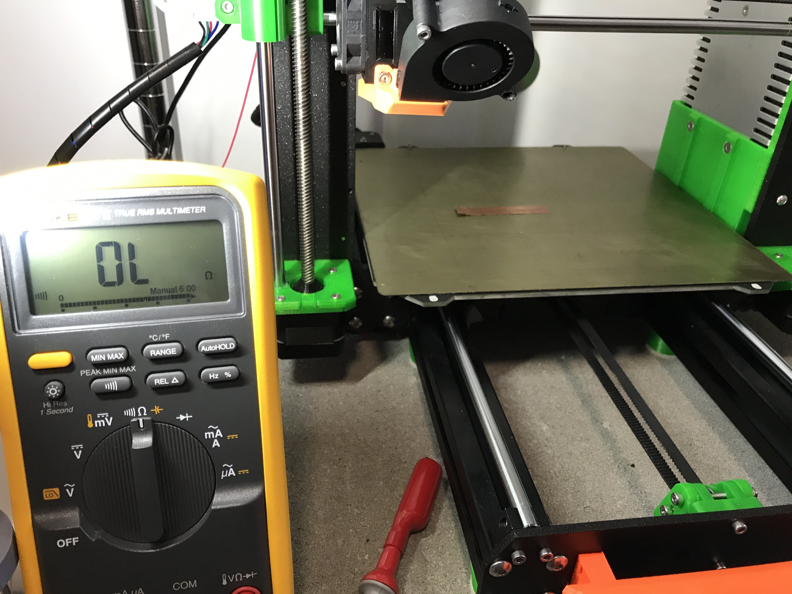
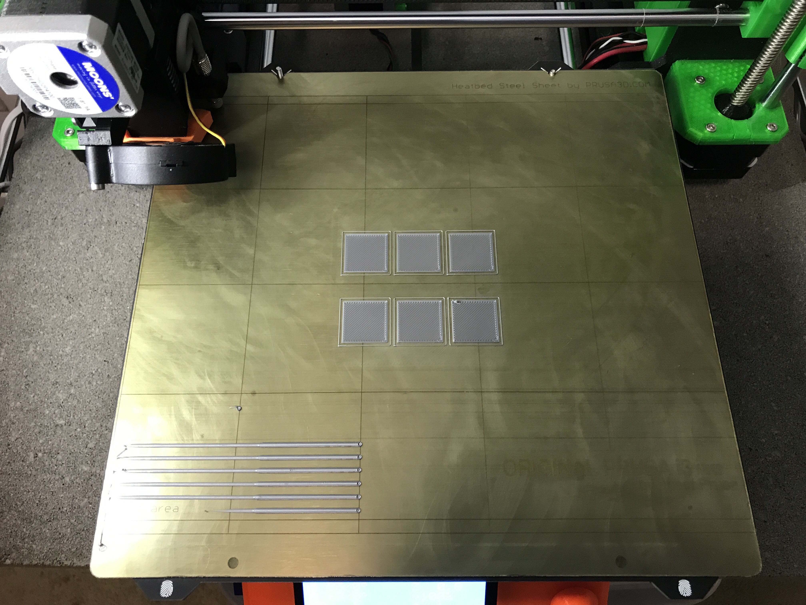

On this page we describe a slight modification of the PINDA temperature compensation table calibration process described in [Manual print based PINDA temperature calibration](Manual_print_based_PINDA_temperature_calibration.md "wikilink"). This modified approach gives similar results, and for some better results (those who have a hard time judging the z-offset by observing the first layer quality). However, it requires some equipment that not every user will have access to, so for most users @stahlfabrik's approach is recommended.

### Summary

The alternate measurement method uses electrical continuity to detect when the nozzle is touching the heatbed. A circuit is created, using either some wire and a multimeter, or a battery, LED, and resistor. The mesh bed leveling is initiated with the PINDA at some set temperature, as described in @stahlfabrik's article. After this, however, the nozzle is moved over a small piece of conductive tape that has been placed on the steel heatbed sheet. The nozzle is lowered using the Live-Z offset feature until it just touches this tape. The nozzle touching the tape closes a circuit, allowing current to flow. The flow of current either causes a multimeter in continuity test mode to beep, or causes an LED to light up. The user then records the Live-Z offset value and repeats this process for the remaining PINDA temperature calibration values.

### Equipment Needed

For this technique you will need the following equipment:

1.  Small gauge electrical wire (TODO: Insert length)
2.  A multimeter with a continuity or ohms setting. Alternatively, you can use an LED, resistor, and battery.
3.  A small piece of [copper tape](https://www.amazon.com/gp/product/B007Y7FV2O/ref=oh_aui_search_detailpage?ie=UTF8&psc=1), or some other conductive surface, that can be attached to the steel PEI sheet.
4.  (Optional) Alligator clips or multimeter probe leads with some sort of clip on them

### Measurement Set-up

Before taking the measurements, you will need to set up a few things. First, heat up the nozzle and unload the filament. Then wait for the hotend to completely cool down before proceeding.

Next, you will need to attach a wire to the heatblock. Strip the insulation from both ends of the wire. It is recommended that you attach the wire to the hot-end by loosening slightly the screw that holds the heater in place. Loop the wire around this screw and tighten it back down. Route the wire along the extruder wire bundle. You can use a few zip ties to secure it. Let the wire hang down on the left side of the printer.

Attach one lead of your multimeter to this wire on the left hand side of your printer. I have some alligator clip leads for my multimeter, so I just used those. Alternatively, you can try and wrap the wire around the probe end, and then tape it in place. The exact method you use to affix it is not important; the goal is to not have to hold the wire in place while taking the measurement. Put your multimeter in Ohms/Continuity-Test mode (the one where it beeps when you touch the two probes together). If you do not have a multimeter, you can build a small circuit with a battery, LED, and (current-limiting) resistor.

Next we will attach the copper tape to the steel sheet. Cut a piece of this tape about 5cm in length. Fold the left-hand 1 cm back upon itself to make a section that will not stick. Stick the tape to the heatbed. I recommend placing it about one cm in front of the line that runs left to right on the heat bed, about midway front to back. The right hand side of the tape should be approximately centered left-to right, with the portion you stuck back upon itself on the left side. Flatten the right hand side of the tape as much as possible. I used a small plastic spatula/scraper for this.

Here is a picture of my printer set up for a measurement:



Now using the printer “Settings/Move Axis” menu, move the print head until the nozzle is centered over the section of tape you flattened out. Note the X and Y values, as we will need to insert these in our G-code later.

Before proceeding, please follow-the set-up instructions in [@stahlfabrik's article](Manual_print_based_PINDA_temperature_calibration.md "wikilink"), specifically disabling Temp Cal in the menus:

1.  In the printer menu, turn the setting for “Temp. Cal.” to “off”.
2.  Use the terminal to your printer to send the command “M861 Z”. This sets all offsets to zero. You can verify that the values were cleared to zero by sending “M861 ?”. This g-code command will instruct the printer to output the current offsets in the EEPROM table.

### Taking a Measurement

The process to prepare the printer for the measurement is very similar to that described in the aforementioned article.

1.  Run some g-code that will heat up the PINDA to a desired temperature, run a mesh bed level, and then position the nozzle over the copper tape
2.  Attach the other probe of our multimeter to that little flap of the copper tape on the left hand side. I use an alligator clip on the end of the probe for this, but use whatever technique works best for you.
3.  Carefully lower the nozzle using the Live-Z Offset feature in the printer menu until the nozzle just touches the copper tape. We will know when it touches the tape because our multimeter will beep (or our LED will light). We want to go slow when lowering the nozzle, so that we don't ram the nozzle into the bed and cause the motors to skip a step. If you do that, I recommend you note the approximate value, repeat the whole measurement at this temp (re-run the g-code), and then knowing the approximate value be more careful about lowering this time.
4.  Record the z-offset value and the associated PINDA temp. **Before you proceed to the next measurement, be sure and remove the probe clip from the tape.**

I recommend you use the bed temperatures described in [@stahlfabrik's article](Manual_print_based_PINDA_temperature_calibration.md "wikilink"), but for all measurements set the nozzle temperature to 170C, and leave it there for the whole measurement. The reason for this is that the hot-end and nozzle can expand and contract with temperature changes, so to get maximum accuracy we want to keep that constant throughout the test. For convenience, here is stahlfabrik's table of recommended bed temperatures:

| PINDA target temp | Used bed temp |
|-------------------|---------------|
| 35C               | 60C           |
| 40C               | 60C           |
| 45C               | 60C           |
| 50C               | 80C           |
| 55C               | 90C           |
| 60C               | 100C          |

### Sample G-Code

Here is some sample g-code for a measurement at 60C

```
; cooldown
M104 S0 ; set extruder temp
M140 S0 ; set bed temp
G28 W ; home all without mesh bed level
G0 Z100 ; Cooling PINDA position
M106 S255 ; Turn fan on
M860 S58; UPDATE WITH PINDA TARGET TEMP MINUS TWO
M107 ; Turn fan off
; warmup
M104 S170 ; set extruder temp
M190 S110 ; UPDATE WITH THE APPROPRIATE BED TEMP
G0 X50 Y50 Z0.15 ; this is a good PINDA heating position
M860 S60 ; UPDATE WITH THE APPROPRIATE PINDA TEMP
; start the print
G28 W ; home all without mesh bed level
G80 ; mesh bed leveling
G0 X129 Y93 Z0.15 F1000 ; UPDATE WITH YOUR X AND Y VALUES
M300 S1396 P714 ; Beep so we know it is ready
```

This g-code will first wait for the PINDA to cool off, before heating the bed and nozzle. Once the bed has reached temperature, it will move the PINDA down close to the bed and wait for it to heat to the target temperature. Then it will perform a mesh bed level and then move the nozzle over the tape. Finally, it will tell the printer to beep so that you know it is ready for a measurement.

In the g-code above, make sure you update the following values:

-   Update the PINDA cooldown target temp on the line that says “UPDATE WITH PINDA TARGET TEMP MINUS TWO”
-   Update the target bed temperature on the line that says “UPDATE WITH THE APPROPRIATE BED TEMP”
-   Update the target PINDA temp on the line that says “UPDATE WITH THE APPROPRIATE PINDA TEMP”
-   On the second to last line, update the X and Y values here with the ones you noted when aligning the nozzle over the copper tape.

The remainder of the process is identical to that described in (you guessed it) [@stahlfabrik's article](Manual_print_based_PINDA_temperature_calibration.md "wikilink"). I've included those steps here so you don't have to ping-pong back and forth between the two articles.

### Calculate offsets

Now that we have the Live-Z offset values, we calculate the ustep values:

```
usteps(T) = (live_adjust(35) - live_adjust(T)) * 400
```

The ustep values have to be integers, so round them off. Be careful to keep track of the sign; the sign is important! I mostly get negative values, but others often get more positive values.

### Store offsets in EEPROM

To store the values to the EEPROM, we use that first new code again: M861

To store -5 for the 40C value, you send the printer “M861 S-5 I0”. And as another example, to store 11 in the 45C offset value, sou send “M861 S11 I1”. So, “I” denotes the index into the EEPROM table, ranging from 0 for 40C to 4 for 60C - remember the value for 35C is the reference point and thus always zero.

By the way, if you want the old standard EEPROM table, you can set that with “M861 !”. I already mentioned that “Z” zeroes the table and “?” queries and prints the table.

### Enable temperature calibration

Now that our EEPROM table is full of reasonably accurate calibration values, we should re-enable temperature compensation in the printer menu. Got to “settings” and enable “temp. cal.”.

How to take advantage of the temperature calibration table
----------------------------------------------------------

So now that you have calibrated the temperature compensation table, you need to make sure that your PINDA is always in the temperature range of 35C to 60C before the printer homes and does the mesh bed leveling. A very easy way to do that is to use the code M860 code again. Because the PINDA calibration starts at 35C, we just need to insert an M860 g-code to tell the printer to start a print only when the PINDA is at or above that value. The g-code snippet below shows how to do that, for the Slic3r slicing software (put this in your Start g-code in the printer definition). Note that the M860 occurs **after** the bed and nozzle heaters are turned on. We want this because we want the printer to check the PINDA temp is at **or above** the specified value.

```
G28 W ; home all without mesh bed level
M104 S[first_layer_temperature] ; set extruder temp
M140 S[first_layer_bed_temperature] ; set bed temp
M190 S[first_layer_bed_temperature] ; wait for bed temp
M109 S[first_layer_temperature] ; wait for extruder temp
G0 X50 Y50 Z0.15 ; this is a good PINDA heating position
M860 S35 ; wait until PINDA is >= 35C
G28 W ; home all without mesh bed level
G80 ; mesh bed leveling
```

### Calibrate Live Z at 35C

Since this process does not include calibration of the Live-Z offset, we need to do that now. Load some filament in your printer, and go through the normal calibration process. Be sure and use the G-code snippet above (or something equivalent), so that your PINDA is in the 35C - 60C range before you do this calibration.

### (Optionally) verify temperature calibration

If your Prusa i3 MK3 runs at least version 3.3.1 you can use [Temp_cal_veri_v5.gcode](files/Temp_cal_veri_v5.gcode "wikilink") gcode file. The purpose is to have a printable test to verify that the values in your EEPROM value are good. The Gcodes prints six squares in one go, on the same plate. This takes a while because the PINDA has to cool down in between printing of each square. You just have to watch and wait. The top left square is printed with a PINDA temperature of 35C, right next to it is a 40C square printed and so on. So the squares are:

```
35C 40C 45C
50C 55C 60C
```

Here is picture of what my print looks like: 

You can visually inspect the squares to make sure that each first layer looks good.