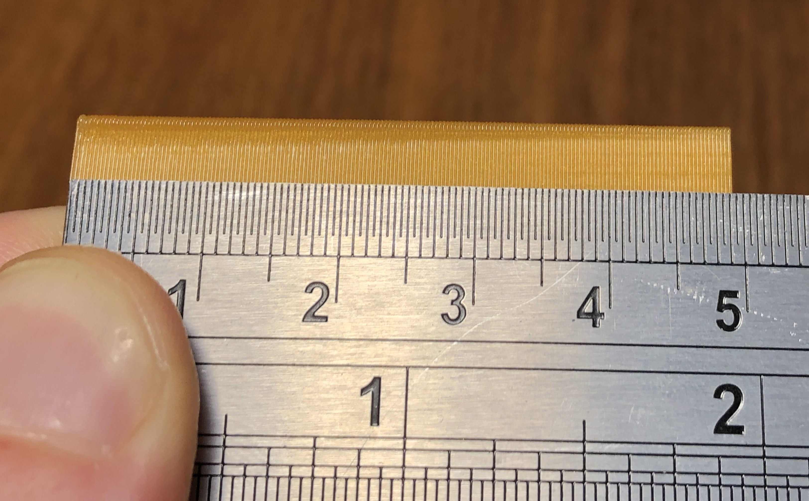

In this guide we explain how to configure _PA_ on _Klipper_ using a specially crafted test object in just __one__ print.

# Quick and lazy (PLA-only)

Start with downloading the specially crafted [test object](files/klipper_PA_calibration_square_0.3mm_PLA_MK3.gcode) and printing it. As the file name suggests this is meant to be printed in _PLA_.

You should end up with a hollow rectangular object. Pay close attention to the corners. You will notice that at the very bottom of the object the corners are way overextruded, causing very noticeable bulging, with the bulging gradually disappearing as the height increases. You can feel the bulging with your finger if you move it over the corner.


You will also notice that the corners start deteriorating after passing a certain height - this will be easier to see on the internal features of the test print where the groove may start blending in and almost disappearing.


Now try to find the height at which the bulge disappears but the corner is still sharp. Use a ruler to quantify this height.



In this example the optimim appears to be at `43mm`. Now all you have to do in order to obtain the _PA_ value is to multiply your optimal height (in millimeters) by `0.004`. For this example _PA_ is `43•0.004 = 0.172`.

Now edit your `Start G-code` under `Filament Settings / Custom G-code` in _Slic3r_ and put `SET_PRESSURE_ADVANCE ADVANCE=PA` there, where `PA` is the value you have calculated.


Please note that this setting is __per filament type__.

Finally, restart _Klipper_, either by issuing `sudo service restart klipper` on the console, or by issuing `restart` in _Octoprint_ terminal.

__This last step is very important.__

# Making your own test object for any filament (advanced)

The general idea is to gradually increase the _PA_ value as the print height increases.

Start with determining the parameters for _PA_ probing, in other words the range of _PA_ values to try out. For _PLA_ you probably want to go from `0` to `0.15`. For _PET_ you may want to start with `0.1` and go up to `0.2`. Please note that _PA_ values above `0.2` will stress the extruder too much and are likely to cause missed steps. Now you have two parameters: `START` and `MAX`.

Decide the total height of the test object (`HEIGHT`). Too low will make it impossible to find a good _PA_ value. Too high is a waste of filament and your time. We believe that `20-25mm` per `0.1` increase in _PA_ is optimal.

In the configuration below we are going to use the following values (so to arrive at the same _PLA_ test object as offered for download in the first section of this guide): `START=0`, `MAX=0.2`, `HEIGHT=50`.

- Get `square.stl` from _Klipper_ sources (you will find it under `docs/prints`) and load it in _Slic3r_.
- Scale it vertically to `HEIGHT` (`50mm`).
- Add the following to the end of your `Start G-code` under `Printer Settings / Custom G-code`:
  ```
  SET_VELOCITY_LIMIT SQUARE_CORNER_VELOCITY=1 ACCEL=500
  SET_PRESSURE_ADVANCE ADVANCE_LOOKAHEAD_TIME=0
  ```
- Add the following to `After layer change G-code`:
  ```
  {if layer_z > 0.4}SET_PRESSURE_ADVANCE ADVANCE={START + layer_z * ((MAX - START) / HEIGHT)}{endif}
  ```
  Please note that `START` and `((MAX - START) / HEIGHT)` are __numbers__. So for our _PLA_ values: `{if layer_z > 0.4}SET_PRESSURE_ADVANCE ADVANCE={layer_z * 0.004}{endif}`
- Set the following slicing settings:
  - Layer height to `75%` of your nozzle diameter (so `0.3mm` for the most common `0.4mm` nozzle).
  - `0` top solid layers.
  - `1` bottom solid layer.
  - `2` perimeters.
  - `0%` infill.
  - `100mm/s` printing speed (for everything save for the first layer).
- Slice and you are ready to go.

Your desired _PA_ value is `START + measured_height * ((MAX - START) / HEIGHT)`, or -- using the sample `START`, `MAX`, and `HEIGHT` values -- `measured_height * 0.004`.
