SPV1 (b3.1)
===========

HW (vitamins)
-------------

What parts you need to acquire, including some you can harvest from spares or the stock extruder.

| Parts                            | For Stock | For Skelestruder  | Notes |
|----------------------------------|-----------|-------------------|-------|
| **Required**                     |           |                   |       |
| Filament sensor                  | 1 | 1 | Stock MK3 Filament Sensor |
| Bowden                           | 1 | 1 | For filament inlet |
| E3d extruder assembler           | 1 | 1 | |
| Bondtech drive                   | 1 | 1 | Standard Bondtech Drive Gear |
| Bondtech idler with bearings     | 1 | 1 | |
| BondTech axle                    | 1 | 1 | |
| PTFE x 13mm                      | 1 | 1 | |
| Nylon washer                     | 2 | 2 | |
| Spring                           | 2 | 1 | |
| M3x10mm screw                    | 10 | 9 | For M3 hardware, check your local hobby shop first, or order from [Bolt Depot](https://www.boltdepot.com/Metric_socket_cap_Stainless_steel_18-8_(A-2)_3mm_x_0.5mm.aspx) |
| M3x30mm screw                    | 4 | 1 | |
| M3x40mm screw                    | 4 | 2 | |
| M3x18mm screw                    | 7 | 3 | |
| M3 sq nut                        | 11 | 4 | |
| M3 hex nut                       | 4 | 6 | Spares (if MK3 bought as kit, otherwise purchase) |
| M3x25mm screw                    | 2 | 3| Spares |
| Zip ties                         | 0 | 2| Spares (if MK3 bought as kit, otherwise purchase) |
| M3 Nylock nut                    | 0 | 2| Spares (if MK3 bought as kit, otherwise purchase) |
| M3x20mm screw                    | 0 | 1| Spares? (if MK3 bought as kit, otherwise purchase) |
| M3x6mm screw (or 4, or 8)        | 0 | 1 | Purchase |
| M3x12mm screw                    | 0 | 2 | Purchase |
| 105zz bearings                   | 0 | 3 | [Purchase](https://www.amazon.com/gp/product/B00ZHSTKCE) |
| 140x6mm GT2 loop belt (70 teeth) | 0 | 1 | [Purchase](https://www.robotdigg.com/product/88) |
| 5x45mm Shaft (Longer is OK)      | 0 | 1 | Purchase<br />Easiest USA: [Custom order with flats](https://us.misumi-ec.com/vona2/detail/110302634310/?ProductCode=SSFJ5-45-A13-E6-WFC4&curSearch=%7b%22field%22%3a%22%40search%22%2c%22seriesCode%22%3a%22110302634310%22%2c%22innerCode%22%3a%22%22%2c%22sort%22%3a1%2c%22specSortFlag%22%3a0%2c%22allSpecFlag%22%3a0%2c%22page%22%3a1%2c%22pageSize%22%3a%2260%22%2c%2200000028943%22%3a%2245%22%2c%2200000346361%22%3a%224%22%2c%2200000346357%22%3a%2213%22%2c%2200000346358%22%3a%226%22%2c%22fixedInfo%22%3a%22MDM00000538433110302634310-1518483034%7c2175%22%7d&Tab=preview)<br />Easiest UK: [Custom order with flats](https://uk.misumi-ec.com/vona2/detail/110302634310/?HissuCode=SSFJ5-45-WFC4-A13-E6&PNSearch=SSFJ5-45-WFC4-A13-E6&KWSearch=SSFJ5-45-A13-E6-WFC4&searchFlow=results2type)<br />(double check 3D render to make sure you see two flats)<br />Lightest: [requires some prep (see below)](https://www.amainhobbies.com/sab-steel-5mm-tail-spindle-shaft-sabh0329-s/p275071)<br />Cheapest: [100mm raw shaft](https://www.amazon.com/uxcell-100mm-Model-Straight-Metal/dp/B01B27MJC6/ref=sr_1_5?ie=UTF8&qid=1532570438&sr=8-5&keywords=5mm+shaft)            | Longer is ok  <br> Available pre-cut with current flat from Misumi  <br> UK source: https://uk.misumi-ec.com/vona2/detail/110302634310/?HissuCode=SSFJ5-45-WFC4-A13-E6 |
| **Optional, but recommended**    | | | |
| Short body Nema17 stepper motor  | 0 | 1 | [Purchase](https://www.amazon.com/Short-Bipolar-Motor-18-4oz-13Ncm/dp/B00PNEQ79Q)<br />[UK Purchase](https://uk.rs-online.com/web/p/products/6783161/?grossPrice=Y&cm_mmc=UK-PLA-DS3A-_-google-_-PLA_UK_EN_Connectors-_-Pcb_Connectors%7CPcb_Connector_Housings-_-PRODUCT+GROUP&matchtype=&gclid=Cj0KCQjwzK_bBRDDARIsAFQF7zOu51jjhMdVWsvYnA3NRbXGu-inR3nOxfX4HcPcTSh-y5xWU3KIinsaAgNJEALw_wcB&gclsrc=aw.ds)<br />I recommend getting one with wire plug on motor for easier assembly.<br />Nema14 is also supported, but Nema17 provides more torque and better center of mass.<br />The plug on the Einsy side of the cable can be purchased from [Ultimachine](https://ultimachine.com/products/2-54mm-1x4-connector-positive-latch-housing-kit-5-pack). |
| New PTFE tubing                  | 0 | 1 | [Purchase](https://www.filastruder.com/collections/e3d-spare-parts-and-accessories/products/capricorn-ptfe-tubing) |
| New GT2 belt to replace X belt.  | 1 | 1 | New X belt is shorter than stock due to new carriage connection. Can just trim stock one instead. |
| Cleaning brush wheel             | 0 | 1 | [Purchase](https://widgetsupply.com/product/ban14.html) |
| **Optional**                     | | | |
| 14T pulley                       | 0 | 1 |(only for 4:1)<br />[Purchase](https://openbuildspartstore.com/gt2-2m-timing-pulley-14-tooth/) |
| 20mm unmount wheel brush         | 0 | 1 | Used for gear cleaner.<br />[Purchase](https://widgetsupply.com/product/ban14.html) |
| 673 (MR63) bearing               | 0 | 1 | Used for indirect sensor<br />[Purchase](https://www.amazon.com/gp/product/B00ZHSQX42/ref=oh_aui_detailpage_o00_s00?ie=UTF8&psc=1) |

Note: Source links for purchase in table above are for reference only. Other suppliers are available depending on your level of impatience :-)

Printed Parts
-------------

**Important**: before you start printing parts, please calibrate your extrusion using this tester: <https://www.thingiverse.com/thing:2996626>

Most of the parts of the skelestruder are 3D printed. One of the nice features of skelestruder, is there are considerable options, in terms of colors and material choices, for these printed parts, allowing you to customize the look and feel. However, there are some basic ground rules you should adhere to in order to not run into issues. In the table below, we will list all the parts, the options for printing each, and notes about how they should be printed. By reading through this table, please be aware of the following:

-   You only need one variant for parts shown with multiple.
-   There are a couple of tools that are optional to print, but will help you with assembly.
-   I exclusively tested with Slic3r. Other slicers should work but your mileage may vary.
-   Parts are designed to fit with high precision. If you deviate from the print settings too much, you may run into problems when you try to assemble.

### Filament Choice

The material recommendations in the printed parts table are based on a mix of experience, expectations, strength, density, glass temp, etc. You can deviate. Let me know what you find. Remember, I am going for light so I want good stiffness/density. For example, motor spider needs to be stiff so I recommend PLA since it has a much higher modulus of elasticity. Here’s a table where I ranked various properties. Note that HT PLA needs to be annealed and it can shrink/distort during that process if you are not careful, leading to fitment issues.

| Material | Weight | Stiffness | Stiffness / Weight | Glass Temperature | Detail Resolve | Environmental Friendliness | Post-processing | Ease of Printing |
|----------|--------|-----------|--------------------|-------------------|----------------|----------------------------|-----------------|------------------|
| PLA (HT) | B      | A         | A                  | C (A)             | A              | A                          | A               | A                |
| PET      | B      | C         | C+                 | B                 | B              | B                          | C               | B+               |
| ABS      | A-     | C         | B-                 | A                 | D              | D                          | A               | C                |
| Nylon    | A      | A         | A                  | C+                | ?              | D                          | ?               | D                |
||

Anecdotally, I have been testing all parts 100% PLA because I have a bunch of spools to burn through. I have had no problems. Others have also printed all parts in 100% PLA without any issues. Note that the extruder fan is blowing cool air over the lower portion the entire time, so very little is exposed to stagnant radiant heat, mainly the cooling nozzle and P rack. The cooling fan is on some even for PETG printing and P rack seems far enough away that I see no issues. I am not in an enclosure though.

I design parts to minimize unique slicer settings, changing orientation, and post-processing. Ideally just print and go. That said, some post-print dressing is helpful. Before starting, clean up parts where they interface, such as removing burrs and blobs. Pre-tap threads in these holes by fully screwing and unscrewing a screw (will make assembly easier):

-   Shroud mounting holes
-   Cooler mounting hole
-   PINDA clamp (not rack)

Test fit all parts to make sure there are no obstructions:

-   Screws should slide through holes that aren’t tapped.
-   The shaft should fit into the wheel hub without too much resistance.
-   Alignment pins fit receiving holes.

It is better to know now and clean up or reprint as needed.

Loosen X motor and then disassemble and remove stock extruder and X carriage by reversing steps in Prusa instructions. Save all parts!

NOTE: pictures are for reference only, instead follow wording closely. Pictures may be from older builds with slightly modified parts.

### Parts Diagram

Refer to the following diagrams to identify the specific parts referenced in the instructions below.


### Parts List

| Part        | Variant + File Name                                                                     | PLA | HTPLA | PETG | Plate | Color      | Notes                                                             |
|-------------|-----------------------------------------------------------------------------------------|-----|-------|------|-------|------------|-------------------------------------------------------------------|
| E cage B    | SP_Ecage_B_b3a.stl                                                                   |     | Y     | Y    |       | User       |                                                                   |
| E cage F    | SP_Ecage_F17_b2b.stl                                                                 |     | Y     | Y    |       | User       | Remove one ring support                                           |
| Spider      | SP_spider14_b1.stl SP_spider17_b2.stl                                               | Y   |       |      |       | User       |                                                                   |
| P rack      | SP_Prack_b3a.stl                                                                      |     | Y     | Y    |       | User       |                                                                   |
| S cartridge | SP_D_cartridge_b2b.stl SP_I_cartridge_b2b.stl SP_spring_b2.stl                  | Y   | Y     | Y    |       | Dark matte |                                                                   |
| Inlet       | SP_std_inlet_b1.stl SP_inlet_ptfe_b1.stl                                          | Y   | Y     | Y    |       | User       | Optionally print at 0.10 with 0.25 nozzle for tighter tolerances. |
| Cover       | SP_cover_b2.stl SP_I-lid_b2b.stl                                                    | Y   |       |      |       | Dark matte |                                                                   |
| Shroud      | SP_shroud_b1.stl SP_shroud_b3.stl                                                   | Y   |       |      |       | User       |                                                                   |
| Knob        | SP_knob_b2.stl                                                                        | Y   |       |      |       | Visible    | Can use Advanced / elephant foot = 0.25mm                         |
| Carriage    | SP_carriage_b3.stl                                                                    | Y   |       |      |       | User       | Do not remove hooks                                               |
| Key         | SP_key_b3a.stl                                                                        | Y   |       |      |       | User       |                                                                   |
| Xclamp      | SP_X_clamp_b2b.stl                                                                   | Y   |       |      |       | User       |                                                                   |
| Tail        | SP_tail_b2.stl SP_fin_b1.stl                                                        |     |       | Y!   |       | User       | PETG highly recommended, for flex on the fin                      |
| Idler       | SP_idler_b2.stl                                                                       | Y!  |       |      | Y     | Visible    | Plate                                                             |
| Wheel       | SP_wheel_b2.stl                                                                       |     |       | Y    |       | User       |                                                                   |
| Tread       | SP_tread_b1.stl                                                                       | Y!  |       |      | N     | User       | PLA highly recommended. Do NOT plate                              |
| Pinion      | SP_pinion_b1.stl SP_pinion_deepflat_b2.stl                                         | Y   |       |      | N     | User       | 3 perimeters. Do NOT plate. Disable “detect thin walls”.          |
| Spacer      | SP_spacer_v1a4.stl                                                                    | Y   |       |      | Y     | User       | Plate                                                             |
| Bracket     | SP_bracket_b1.stl SP_bracket_volcano_b2.stl                                        | Y   |       |      | Y     | User       | Plate                                                             |
| Cooler      | SP_noz_v6_b3.stl SP_noz_volcano_b2.stl SP_noz_volcano_b3.stl SP_nozPR_a8.stl |     | Y     | Y    |       | User       |                                                                   |

Component/Part Prep
-------------------

Click on photos to enlarge

### Direct Cartridge

Insert filament sensor in cartridge. Screw down carefully, similar to PR instructions

-   1x M3x10mm

Insert smaller PTFE into cover inlet.

-   1x PTFE

Screw cover in corner onto cartridge a little bit for now

-   1x M3x10mm

Set aside safe

 |PTFE in cover inlet 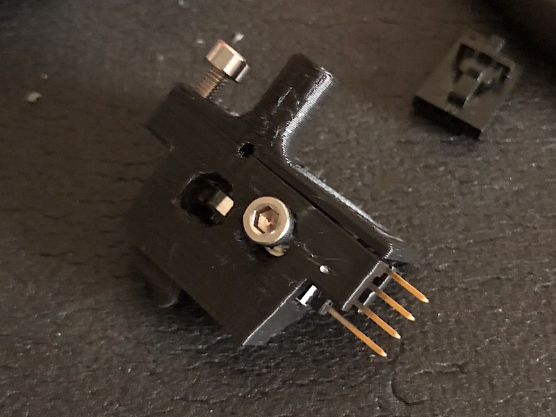 |Sensor cartridge

### Indirect Cartridge

Slip sensor in from end of I-lid and screw down

-   1x M3x10mm

Insert PTFE into I-lid inlet

-   1x PTFE

Slide 673 bearing onto spring about 1/3 (may need to chamfer ends with knife)

-   1x 673 bearing

Snap spring into I cartridge, then screw I-lid onto I cartridge and set aside

-   1x M3x10mm

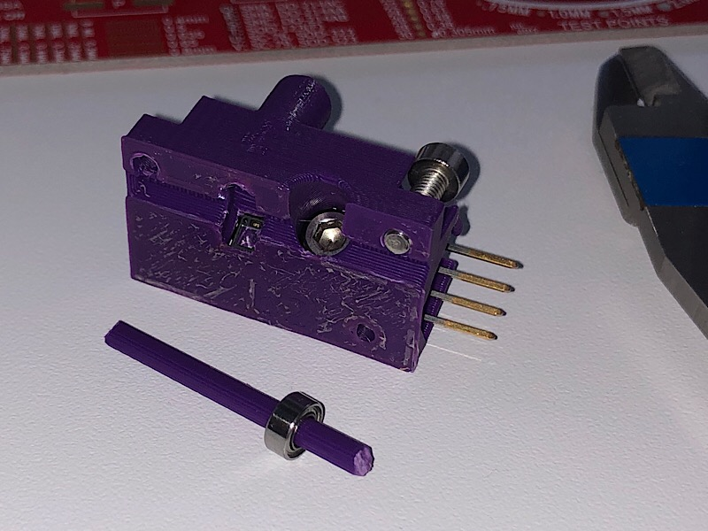|Start 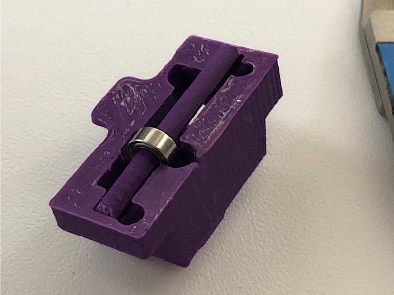|Install 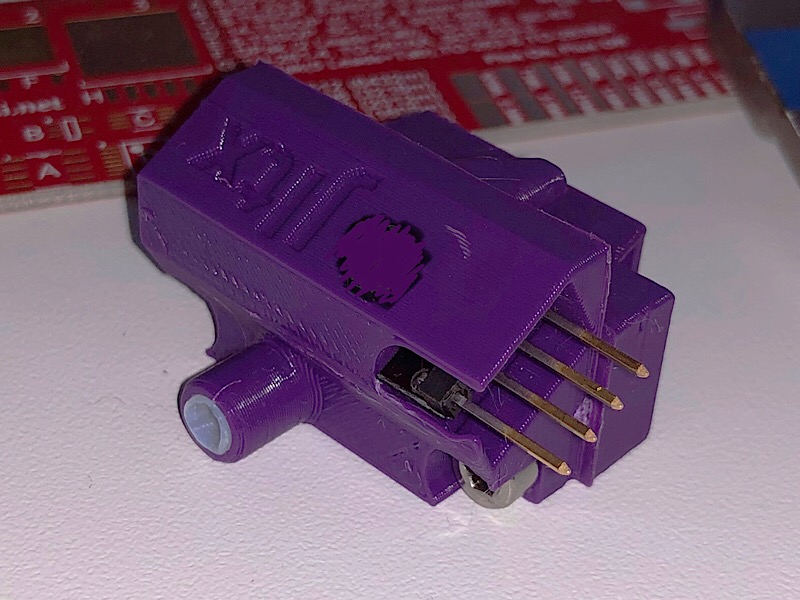|Done

### Carriage

Slip square nuts into slots in top bearing cups

-   2x sq nut

Make sure they are seated at bottom, can use 1.5mm hex wrench to press in. Use Sharpie to mark line on each bearing indicating ball line (needs to be done before assembling X gantry, otherwise don’t sweat it). Align bearings with bottom facing out, top two facing out but skew slightly (see picture) Snap carriage onto bearings. Zip tie top bearings, start from bottom hole and come out top hole (see 3rd pic)

-   2x zips

Snap x clamp onto bottom bearing. Screw down

-   2x M3x10mm

Insert two hex nuts into pockets on key block

-   2x hex nuts

Screw key onto front of carriage using hole below top bearings

-   1x M3x10mm

Screw tail or fin onto X clamp

-   1x M3x25mm

Do not attach belt yet. Slide carriage back and forth by hand to make sure it glides smoothly

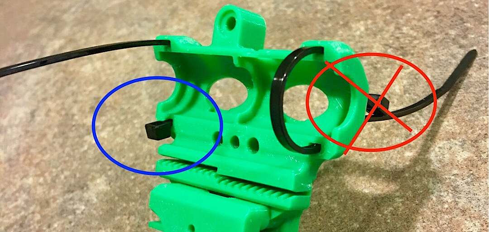 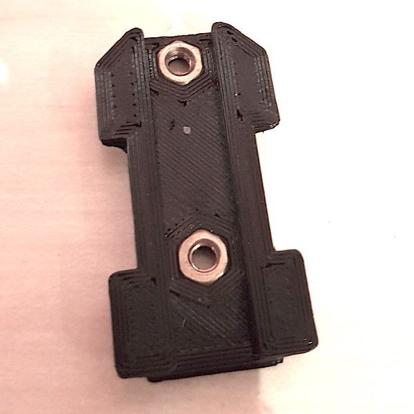 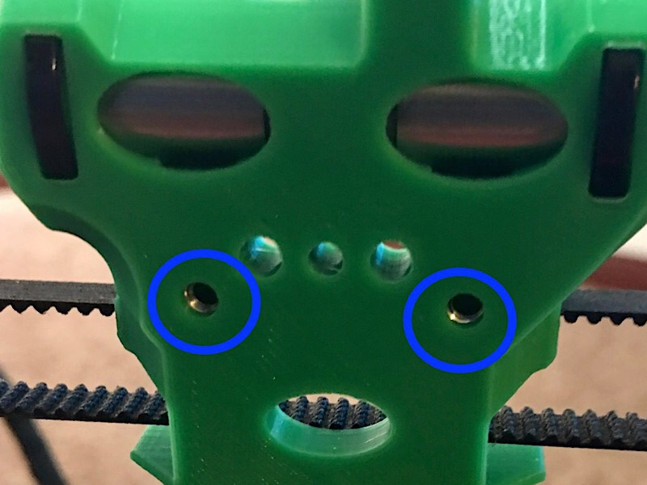

### Inlet

If you want, you can swap out to Capricorn tubing which is more slippery. For ptfe inlet, trim ptfe tube to match inlet profile (see pic. Note that new inlet is now keyed unlike picture). *OR* for std inlet, straight cut flush to overall length of 38mm\[?? Need to confirm\]. If using new ptfe tubing, make sure bottom is both tapered and chamfered to match heatbreak -&gt; can use ptfe jig and razor blade. Push inlet onto Bowden of e3d

-   1x Bowden

### E-Cage

Insert Nyloc nut into top hole on cage F

-   1x Nyloc

Put one square nut into cage F at center, can use small screwdriver to help press in place

-   1x sq nuts

Press bearings into bearing holes on cage F & B so flush -&gt; can use bearing press if desired

-   2x 105 bearings

Slip motor anchor screw through bottom hole on cage F

-   1x M3x18mm

Insert to hex nuts in pockets on back of cage B

-   2x hex nuts (optionally can use nylock nuts)

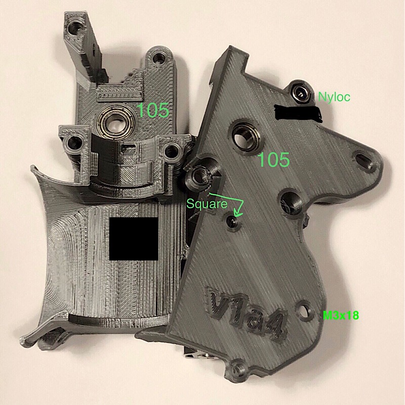 |Ecage

### P-Rack

Use free screw to make sure it slides through holes in knob holder braces. Can use threads to ream out slightly as needed. screw from bottom of P rack up until snug

-   1x M3x30mm

There is a hex nut pocket on top to lock screw, but I’ve found it does not slip without it Optional: you can thread cam (tab down) on top of P rack to remove any play once set insert hex nut into knob

-   1x hex nut

Slip knob between braces on cageB with nut facing \*down\* Note that there is one detent on knob that extends to edge which should be alined with tooth on brace to make it easier to insert carefully insert screw through bottom holder into knob and turn knob to start thread If using cam, make sure it is rotated back for clearance watch P rack to make sure it dovetails onto slide turn knob until P rack as approx as shown in photo

### E3d

Insert inlet and heatsink, aligning key, into E-Cage-B. Press E-Cage-F on top, first aligning top pin, then making sure inlet fits slot. Rotate heatsink so that heat block is straight. Also make sure Bowden aligned with inlet if tapered

Insert screws into middle

-   2x M3x25mm

Screw E-cage together using the two middle screws, snug but not tight. Slide long screw through top hole temporarily to make sure cage is aligned, then tighten down middle screws (not long screw!)

-   1x M3x40mm


### Motor

Press bearing into spider hole so flush on both sides

-   1x 105 bearing

Press pinion gear onto motor shaft (keyed) with collar to outside (pic shows older metal pinion)

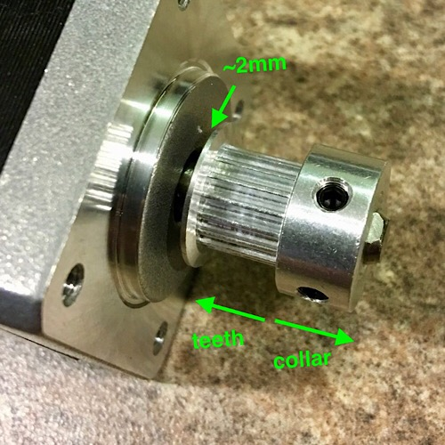

### Noctua

Carefully screw shroud onto front edge of fan, it is delicate. Wires can go next to edge of top shroud, or away from shroud as shown in picture.

-   2x M3x18mm

Screws will stick through back of shroud, used for wire mgmt and hanging cooler later.

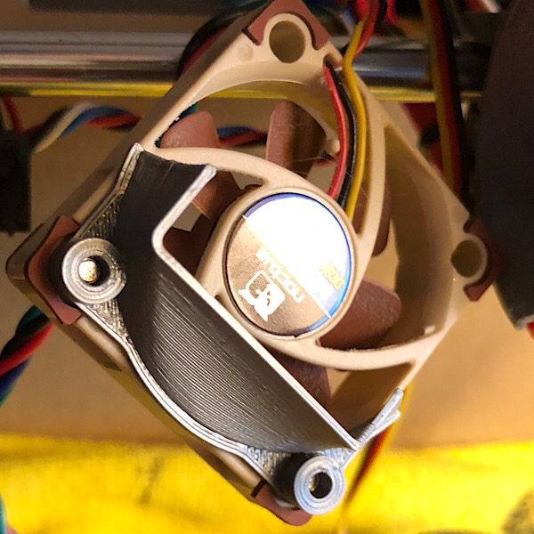|shroud

### Idler

With support cylinder still in place and flat side on table, press bondtech axle into idler until it hits cylinder (about 3mm)

-   1x axle

Note that one end of axle is slightly chamfered. This end should go in first. Now remove support cylinder by twisting with pliers add bond tech idler and bearings with teeth at bottom, press axle through.

-   1x bondtech idler w/ bearings

Counter-sink axle slightly to make sure axle bites both sides. Make sure gear spins freely

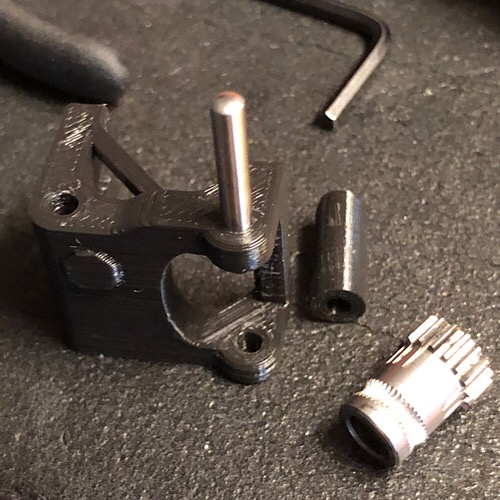 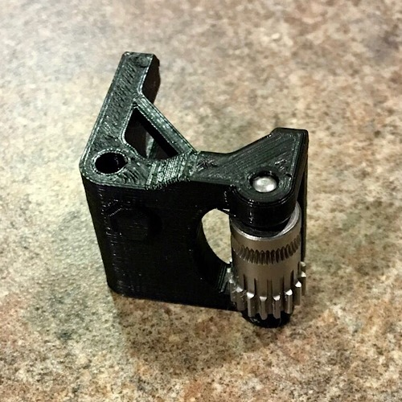

### Tensioner

Insert hex nut into tensioner knob

-   1x hex nut
-   1x M3x40mm

Slide spring onto screw

-   1x spring

and lightly screw on tension knob so screw tip is flush with hex nut inside tensioner knob

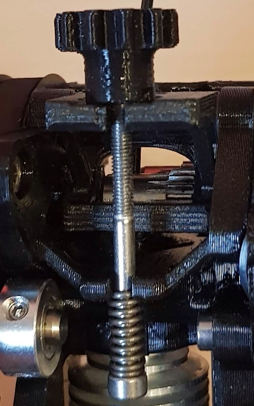

### Part fan

Insert hex nut into bracket

-   1x hex nut or Nyloc (preferred)

screw onto top hole (near wires) of fan allowing rotation

-   1x M3x18mm

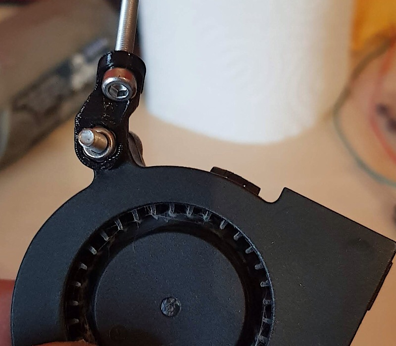

### Wheel

insert 1 square nut into nut pocket

-   1x sq nut

insert short screw into hole (see photo)

-   1x M3x6mm (or 4mm or 8mm)

screw in just enough to catch threads of nut, but not go past flush Check that wheel can slide onto axle cleanly, then remove from axle

snap tread over wheel, first aligning the access holes Note that the wheel is not flush with tread by design, there is a small lip

### Shaft prep

If you ordered the Misumi custom shaft from link at top you can skip this section. Otherwise, you will need to cut some flats for grip.

The RC heli spindle is the perfect size and very light, but you can also cut your own from larger stock. If you have a raw cut end, lightly chamfer one end with file (just to remove any burrs).

Mark 15mm from the end with sharpie.

Grind a small flat, at least 4mm wide, into shaft 0.45mm deep (no deeper), centered at the 15mm mark. Go slow and measure frequently so you don’t go too far.

Do the same at 37mm from same end.

You can go wider than 4mm, such as using a bench grinder. I used a Dremel with cutting wheel.

Mark a line with sharpie along shaft to indicate flat orientation.

Next photo is using a spindle shaft from RC heli which is perfect size out of the box, and hollow so lighter. Be extra careful making flats since it is hollow. I only went about 0.3mm deep at 37mm mark since that needs a bit more strength.

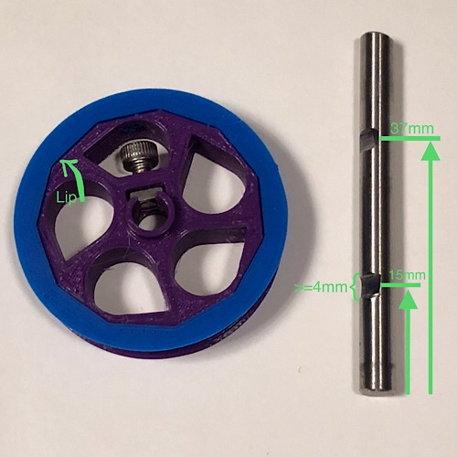|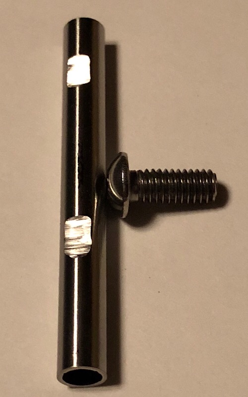|shaft

Assembly
--------

Slide shaft through wheel (do not tighten!), then Slide through Ecage F bearing Be careful to keep shaft straight so you don’t torque front bearing Slide through bondtech drive gear with teeth toward rear

-   1x bondtech drive

Finally slide shaft through Ecage B bearing until it is just flush with bearing, not protruding any Now while pressing wheel against cage F front bearing, tighten wheel screw onto shaft on flat by lining up mark Turn shaft so you can see mark and rotate Bondtech gear so set screw is aligned with mark Temporarily Insert piece of filament into Bowden to use for alignment Make sure hobb of gear is aligned with filament path Lightly press wheel against Ecage F and tighten Bondtech set screw onto flat Remove filament and check that you can turn shaft easily, even spins

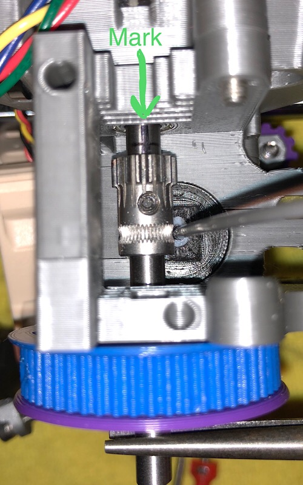 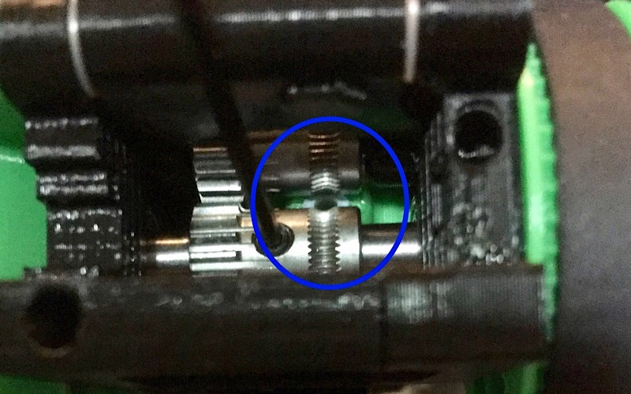

Slide on spacer with flat side against wheel wrap GT2 belt loop over wheel

-   1x 140 GT2 loop

Use tensioner to prop up belt so it does not catch on next step

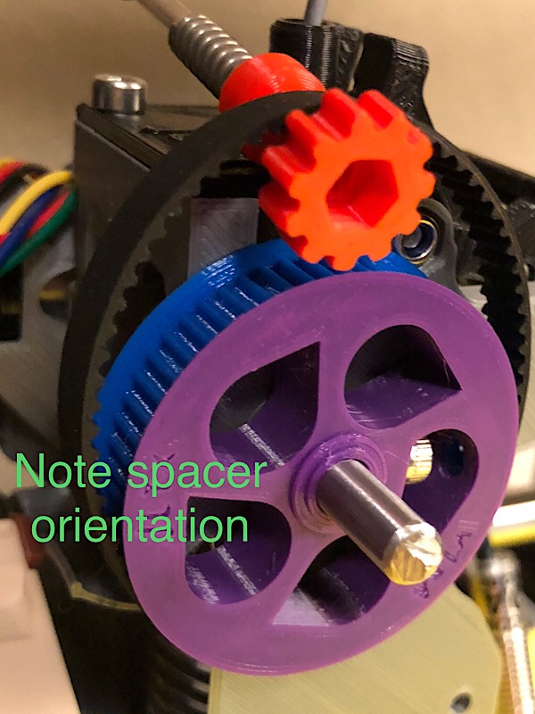

Slide spider bearing over shaft, up against spacer, watching the bottom leg does not snag belt, while also inserting anchor screw Screw spider onto cage F in hole below wheel snug but not tight

-   1x M3x18mm -&gt; temporarily, will switch to 20mm later

Remove tensioner prop and pinch belt to create loop to insert pulley and screw motor to spider loosely (orient motor so wires are on left, not like picture)

-   1x M3x18mm
-   1x M3x10mm

Make sure belt sits on pulley teeth, not collar First Snug up screws then back off 1/2 to 1 full turn. Rotate motor body clockwise to take up slack in belt loop. Do not over tension! Does not need to be tight like X and Y belts. I gently pinch motor and spider while tightening 1 and 2. First tighten short side screw, then top screw, lastly bottom anchor screw.

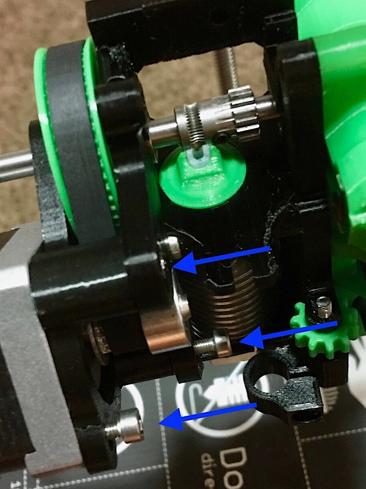 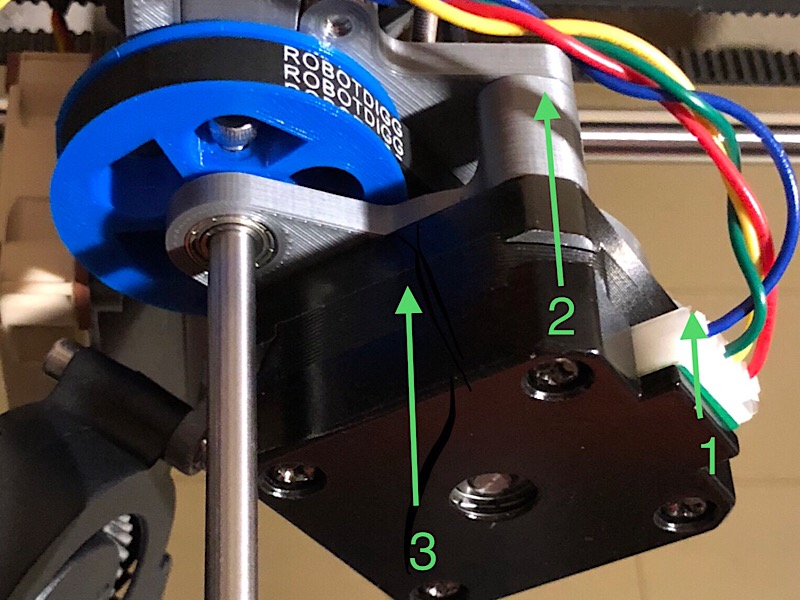

Slide cartridge into top and screw tight Add last screw to hold cover to cage

-   1x M3x10mm

Insert 40mm screw in top hole from cage B back with about 1mm tip protruding, just enough to hang first nylon washer Slide in idler and slide screw through most of idler, then add second washer and push all the way through and screw down \*lightly\*

-   1x M3x40mm
-   2x nylon washer

Screw head will not be flush!!

Screw Noctua onto cage b mounts

-   2x M3x12mm

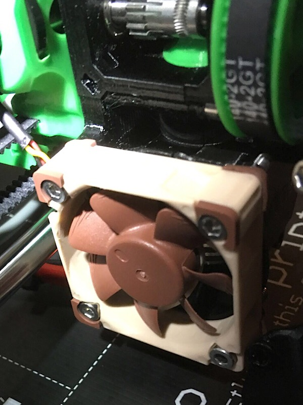

Screw fan onto bracket and rotate fan up a little.

-   1x M3x20mm -&gt; replace 18mm that was there

Keep screws a little loose. Attach nozzle, and screw onto bottom screw of Noctua shroud Rotate fan down into nozzle, then tighten bracket screw

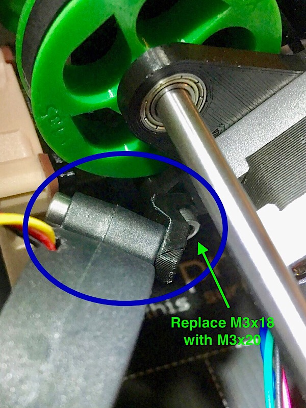

Slip PINDA into holder with tip slightly above nozzle height as normal tighten medium (screw head almost flush)

-   1x M3x10mm

Optionally, route heater & thermistor wires up channel in back of cage B. Slip through hole and route out under shaft, away from idler

Slide entire extruder onto key block and slide down, making sure heater wires fit into channel on key Watch the top screw slides into mount on carriage Secure extruder using screw tabs on either side

-   2x M3x10mm

Tighten M3x40mm idler screw, but do not over tighten! Maybe snug then back off 1/2 turn. Make sure idler swings smoothly, but not so loose it falls down if you let go. Make sure Nyloc nut didn’t get pushed out and is not protruding from front face. Check the bondtec teeth mesh cleanly.

Slide tensioner screw head into bottom slot with spring below Pull up and hook knob into slot on idler Make sure two pivots on tensioner knob are in detents on idler (the arrows on top of knob should always point front to back)

Double check all screws are snug. Make sure all moving parts move freely

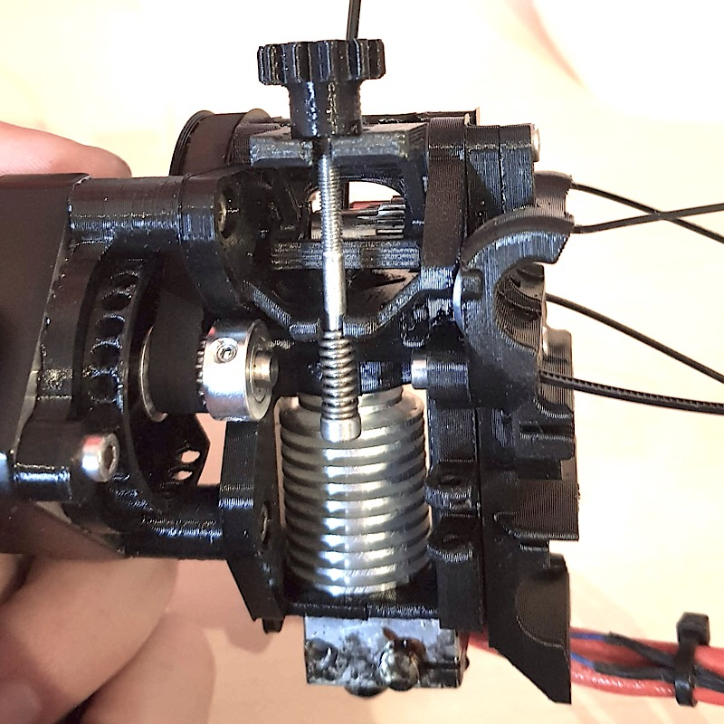 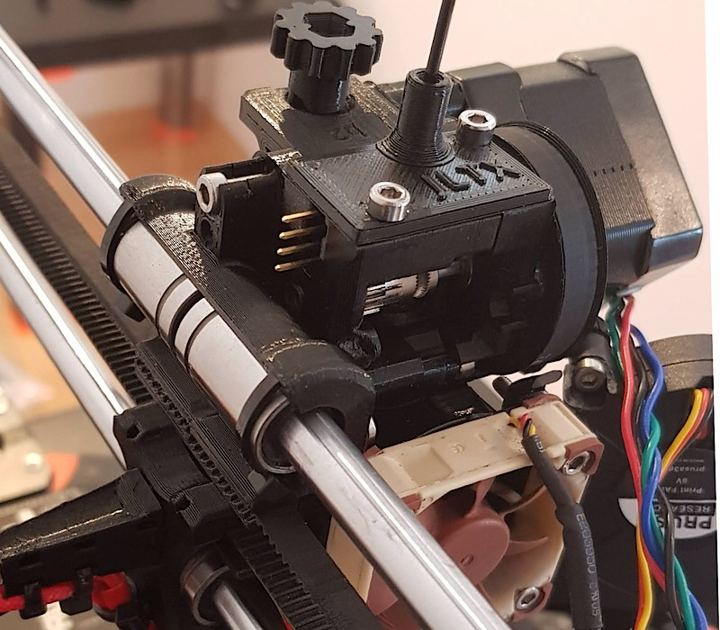

### Cable management (one way, but do what you will):

-  Pinda: route wire up between top belt and top bearing.

Rotate Zip head down to lock into place (see pic).

-   Noctua: treat same as pinda (see pic).
-   Blower fan: route wire along top of Noctua, outside tab.
-   Motor: similar route as blower fan.

Insert zip into channel in back corner of Ecage B (there are two choices to pick from depending on route you chose). Capture Noctua, blower, motor wires. Route around side of carriage, over top belt toward sensor. Bring down filament sensor wire from top.

Optional: Insert M3x?? Screw into center hole on carriage to guide wires around left side (looking from behind). Zip tie down to X clamp

Tail:

- Pull along tail and zip tie down
- Also zip up heater cables underneath tail from below
- Can use screw access hole in tail to insert Nylon filament if using

Fin:

- Run along right side and zip through main center hole
- Snap one wire into each holder

Add spiral or sleeve

### Attach belt to carriage

Measure twice, Cut once.

Either install new belt or trim stock belt to fit new carriage. You want enough length to get all teeth engaged.

Fully insert in one side, the loop through both X ends (with motor slack). Pull snug and trim belt at innermost tooth. Slide in to belt holder and tighten motor.

-   do not over-tighten\*

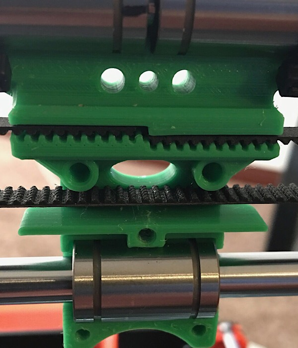

Optionally, you can add a hobb cleaning wheel, for example printing TPU. Use an M3x30, add the collar, then a 20mm brush wheel, then hex nut. Fit screw tip into stirrup on CageB and snap head into clip on CageF

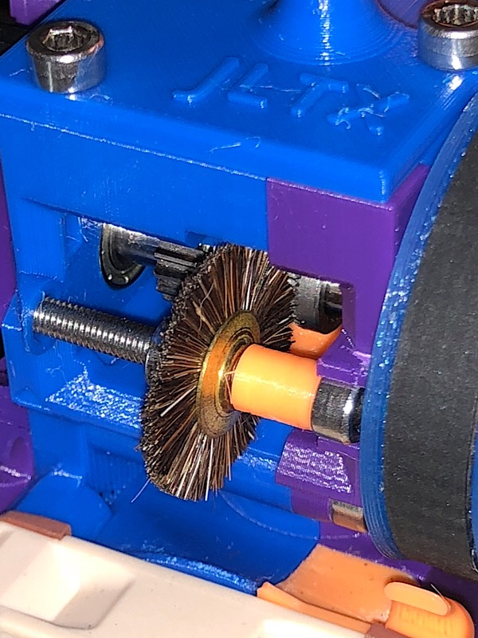

Tool-free Operation:
--------------------

To adjust PINDA height, e.g. after changing nozzles, turn PINDA adjust knob counterclockwise (looking down at bed) to lower PINDA (which increases nozzle clearance to bed). Each detent click is 0.1mm height change.

To adjust tension on idler, turn tensioner knob clockwise (looking down) to increase tension. Turn 1/2 turns only and make sure pivots are set in idler. There are indicators on the top of the knob aligned with the pivots. Hold screw head to keep it from turning.

To quickly disengage Bondtech gears (e.g. manual load / unload filament), just pull up from under idler edge (not the knob!) slightly until you can free filament. I brace my thumb on the filament cover. I use this to catch/hold the filament while I wait for nozzle to heat before fully loading.

To swing idler up for access to gears, unhook tensioner by lifting knob up slightly while sliding out of idler. Then drop slightly to release spring tension and pull tensioner out completely. Now idler gate can be swung all the way up. BE CAREFUL and watch pinda cable when removing and installing tensioner.

Slic3r Profiles
---------------

You can use the standard profiles. But here is an example to exploit more speed (remove .txt extension):

<a href="files/0.3mm_FastProto_Volcano.ini.txt">0.3_FastProto_Volcano.ini.txt</a>

Software changes:
-----------------

On first run, you should just need to do a Z calibration, followed by a first layer calibration. A full XYZ should not be necessary. Need to change E steps to 980 (see below)

Gcode: Get settings M503

Need to change E steps to account for gear ratio (3.5:1) M92 E980

Save settings M500

Change motor current, depending on your motor, if it gets too hot using stock settings: I found that I needed to reduce the default E motor current for my smaller motor. If it’s not getting too hot, leave it default (30). Example: M911 E24 ; set holding current lower M912 E24 ; set running current lower M910 ; commit new currents until power cycle

INFO: M910 - Reset and initialize the TMC2130 chips.

- Most setting changes won't go into effect until this code is sent.

M911 - Holding current M912 - Running current

- Set the above TMC2130 currents.  Must be given in current scalar values (0 to 63).
- Example:  M911 X14 Y20 Z30 E36

M913 - Print the currently set TMC2130 current values

I wanted to make it so that you only need to make some gcode changes to operate. This is mostly true. Unfortunately, due to the shorter stack, the filament unload sequence assumes the wrong amount to unwind and doesn’t properly cool the hot bulb which can cause it to stick in cartridge. You can simply unscrew the cartridge and clip off the end to free it (handy trick of skelestruder). But if you do frequent filament swaps, this can be annoying. So best option is to modify the sequence in firmware. Since you are recompiling, might as well set the E steps to 980. Following is a patch file for MK3 3.3.1 you can apply or follow manually to make the changes.

<a href="files/SPV1_3.3.1.patch">SPV1 3.3.1.patch</a>

- changes E steps, motor current, filament load/unload

- adds nozzle only pre-heat to menu, fixes variable type for clean compile with latest Arduino

Apply at Prusa-firmware level: patch -p1 -I SPV1_3.3.1.patch

This should apply directly to 3.3.1. IF you grab ToT it may not go cleanly.

If it fails, you will see .rej files that show which chunks it could not find. That is usually from them moving line number around too much.

You can just search and replace by looking at the context in the \*.rej file since it's just a text diff.

Note: if you went with the indirect sensor cartridge, you \*do need\* to make a change. See patch below.

To confirm it is working after flashing: got to Support menu / Extruder info

You will see Fil Xd 0 Yd 0

Insert filament manually and make sure Yd increases as you insert and decreases as you retract

If it changes the other way, you didn't get the sign flipped correctly.

If it doesn't move at all, check that the bearing spins freely. Also check that you can see both the filament sensor and the laser illuminator through the access port in I-lid

The laser is a small dot above the square sensor. If it is blocked, it cannot see the bearing.

### Editing Needed Below?

This patch is only for indirect filament sensor, changes sign of Y motion

```
diff --git a/Firmware/pat9125.cpp b/Firmware/pat9125.cpp
old mode 100755
new mode 100644
index 4894c85..5497467
--- a/Firmware/pat9125.cpp
+++ b/Firmware/pat9125.cpp
@@ -180,7 +180,7 @@ int pat9125_update_y()
                        if (pat9125_PID1 == 0xff) return 0;
                        int iDY = ucYL | ((ucXYH << 8) & 0xf00);
                        if (iDY & 0x800) iDY -= 4096;
-                       pat9125_y -= iDY; //negative number, because direction switching does not work
+                       pat9125_y += iDY; //negative number, because direction switching does not work
                }
                return 1;
        }
```
