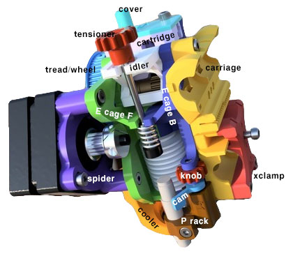
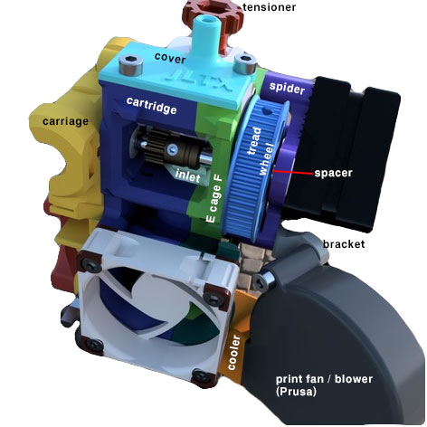

Skelestruder is a custom 3.5:1 (or 4:1) geared extruder with mostly printable parts for the Prusa Mk3, designed by JLTX

Link to parts <https://www.thingiverse.com/thing:2845416/#files>

Improved instructions &gt;&gt;&gt; [Skelestruder Assembly](Skelestruder_Assembly "wikilink")

Sortable, filterable spreadsheet with part/file names, and recommendations for material and color is available [here](https://docs.google.com/spreadsheets/d/19_bpOaFNy87UGM9JST4Ibljp2dwbiq5kfsb0czmPD2Y/edit?usp=sharing).

### 3d renderings with labeled parts

