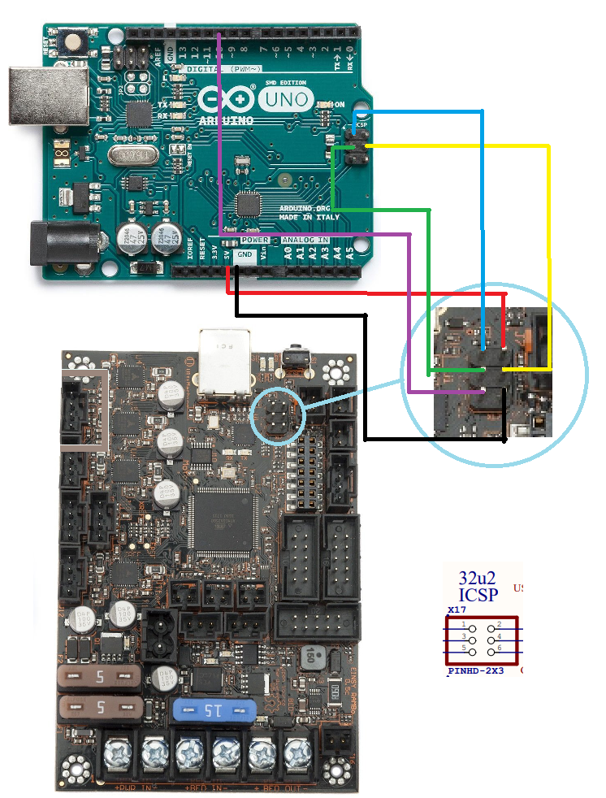

Hoodloader2
================
Why Hoodloader2?
----------------
USB serial communication problems are common on the Einsy Rambo, affecting users both on stock Prusa Firmware using Octoprint and users that have migrated to Klipper. There are various factors involved with connection issues, however the most glaring culprit is the firmware running on the Atmega 32u2 processor that serves as a bridge for USB communication between the host machine (likely Raspberry Pi) and the Einsy's main processor, an Atmega 2560.

Hoodloader2 has functionality that goes beyond simple serial communications, however its primary benefit is vastly improved stability for USB and support for up to 2M baud full duplex serial communications.

Caveats
-------
* Because Hoodloader2 supports uploading sketches to the 32u2 in addition to the Atmega 2560, a baud rate of 57600 is reserved.  Thus you cannot connect to USB serial using this baud rate.  But really, why would you want to do that?

* Your Einsy will no longer enumerate using Prusa's Vendor and Product IDs.  It will show up as either "Hoodloader2 Mega" or as "Arduino Mega", depending on your platform.

* You will need a programmer to flash back to a standard DFU-usbserial setup.  However an Arudino can be flashed to work as a programmer without much of an issue.

Recommended - Record the serial number for your Prusa Einsy
-----------------------------------------------------------
Just in case you want to keep it.  With your MK3 powered on and connected to a Pi, ssh into the Pi and enter the following command:

```dmesg | grep usb```

Your output should look something like the below:

```script
[71569.010832] usb 1-1.4: new full-speed USB device number 10 using dwc_otg
[71569.155624] usb 1-1.4: New USB device found, idVendor=2c99, idProduct=0002
[71569.155639] usb 1-1.4: New USB device strings: Mfr=1, Product=2, SerialNumber=3
[71569.155648] usb 1-1.4: Product: Original Prusa i3 MK3
[71569.155657] usb 1-1.4: Manufacturer: Prusa Research (prusa3d.com)
[71569.155665] usb 1-1.4: SerialNumber: ALPHANUMERIC123
```
Record and save whatever is in the Serial Number Field.

Installing Hoodloader2
-----------------------
Hoodloader2 may be installed by using an Arduino Uno, or via progammer.  Both methods are covered in this document.

Install Method 1:  Arduino Uno
------------------------------
This method uses an installation sketch uploaded to an Arduino to flash the Einsy's Atmega 32u2.  While this document covers how to use an Arduino Uno, other Arduino's such as a Nano should work.  You will need 3 dupont male to female jumpers, and 3 dupont female to female jumpers.

1) Download the latest version of the Arduino IDE.
2) Clone the Hoodloader2 git repository:
`git clone https://github.com/NicoHood/HoodLoader2.git`
3) Open the sketch in the Hoodloader2 repo located at:
`/avr/examples/Installation_Sketch/Installation_Sketch.ino`
4) Change line 11 to the following:
`#define HEXFILE HEXFILE_HoodLoader2_0_5_Mega_atmega32u2_hex`
5) Save and upload the sketch to your Uno.
6) Disconnect your Einsy from USB and Power.  Disconnect your Uno from USB.
7) Use the following diagram to make your connections:


| Uno Pin | Einsy ICSP Pin | Color |
|---------|-----------|-------|
| MISO | Pin 1 (MISO) | Blue |
| +5v | Pin 2 (USBVCC) | Red |
| SCK | Pin 3(SCK) | Green |
| MOSI | Pin 4(MOSI) | Yellow |
| Pin 10  | Pin 5 (Reset)| Purple |
| Ground | Pin 6 (Ground) | Black |

8) Connect your secondary Arduino to your PC via USB.  Open the Arduino IDE's serial console at 115200 baud.  Watch as the firmware upload completes.
9) Disconnect everything.  Connect power and USB back to your Einsy.  Run the following command if connected to a linux based system such as a Raspberry Pi:
`ls /dev/serial/by-id/`
The output should be:
`usb-NicoHood_HoodLoader2_Mega-if00`
10) You are now ready to print with improved communication stability.

Install Method 2: Programmer
----------------------------------------
602 Wasteland community leader Zbrozek has contributed a simple method for programming with a USBasp.

1) Disconnect USB and Power from the Einsy
2) Connect the USBasp to the Einsy:

| USBasp | | Einsy ICSP|
|--------|-|-----------|
| Pin 1 | MOSI | Pin 4 |
| Pin 2 | VCC | Pin 2 |
| Pin 4 | GND | Pin 6 |
| Pin 5 | Reset  | Pin 5 |
| Pin 7 | SCK | Pin 3 |
| Pin 9 | MISO | Pin 1|

You may also refer to the image in the previous section to see the pinout for the Einsy's 32u2 ICSP header.

3) Run the following commands:

```shell
wget https://raw.githubusercontent.com/NicoHood/HoodLoader2/master/avr/bootloaders/HexFiles/HoodLoader2_0_5_Mega_atmega32u2.hex
avrdude -c usbasp -p m32u2 -U lfuse:w:0xEF:m -U hfuse:w:0xD8:m -U efuse:w:0xFC:m -U flash:w:HoodLoader2_0_5_Mega_atmega32u2.hex:i
```
Presumably this can be adapted to other programmers by changing the avrdude command.

4) Disconnect everything.  Connect power and USB back to your Einsy.  Run the following command if connected to a linux based system such as a Raspberry Pi:
`ls /dev/serial/by-id/`
The output should be:
`usb-NicoHood_HoodLoader2_Mega-if00`
5) You are now ready to print with improved communication stability.

